# Goodwill Events
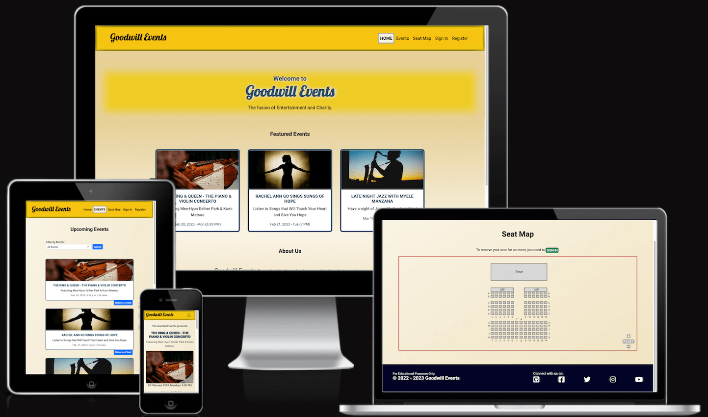     
**Goodwill Events** is a fictional charity organization that produces a variety of entertaining events, such as concerts, recitals, and dance performances. This website serves as its platform for registering new members, displaying upcoming events, and reserving seats for an event. Additionally, signed-in users can 'like' and leave comments on individual event posts. [View Live Website.](https://goodwill-events.herokuapp.com/)

## TABLE OF CONTENTS
* [**User Experience Design (UXD)**](#user-experience-design-uxd)
    * [**STRATEGY**](#strategy)     
        * [Main Goal](#main-goal)     
        * [Target Audience](#target-audience)     
        * [EPICS](#epics)     
        * [User Stories](#user-stories)
    * [**SCOPE**](#scope)   
        * [Planned Features](#planned-features)   
        * [Design Choice](#design-choice)
    * [**STRUCTURE**](#structure)   
        * [Interaction Design](#interaction-design-ixd)
    * [**SKELETON**](#skeleton)     
        * [Database Schema](#database-schema)     
        * [Wireframes](#wireframes)
    * [**SURFACE**](#surface)   
        * [Color and Contrast](#colors--contrast)     
        * [Typography](#typography)   
* [**Features**](#features)
* [**Features for Future Implementation**](#features-left-for-future-implementation)
* [**Fixed Bugs**](#fixed-bugs)
* [**Bugs Left To Fix**](#bugs-left-to-fix)
* [**Testing**](#testing)
* [**Deployment**](#deployment)
* [**Technologies**](#technologies)
* [**Credits**](#credits)
* [**Acknowledgment**](#acknowledgment)

## User Experience Design (UXD)

### **STRATEGY**
#### **Main Goal:**
This website aims to showcase upcoming charity shows and events by the fictional organization **Goodwill Events**. And it provides numerous conveniences to philanthropists, such as its online membership registration and seat reservation features. It also allows members to leave comments and likes on specific upcoming events.

#### **Target Audience:**
* Philanthropists or people who are interested in charity work and are willing to support the cause of a charity organization;     
* People who enjoy attending concerts and shows for their entertainment value;
* People who prefer convenience when attending events by being able to choose and reserve preferred seat/s ahead of time;
* People who like to feel involved and able to show support for a specific event by commenting and liking an event post.

#### **The Use of Agile Methodology**
The project was developed using the Agile Methodology. To guide the design and structure of the website, nine EPICS were established at the start of the project. Each EPIC contained several User Stories that specified the features of the project. A story point (ranging from 2-8) and priority label (Must-Have, Should-Have, Could-Have, and Won’t-Have) were assigned to each User Story to guide the estimation of time needed for implementation and prioritize the most vital components of the site. Acceptance criteria were included in each User Story, which served as a basis for determining successful implementation. Tasks were also specified for the creator to fulfill the acceptance criteria. In total, 31 User Stories were formulated for this project, with 29 being implemented and the remaining 2 left for future implementation. These 29 User Stories were divided among four planned iterations, with each iteration having a different timeframe due to the creator's other professional obligations.

Github’s Kanban board is an extremely useful feature that this project used. Through it, tasks were marked conveniently when done, and User Stories were closed when fulfilled. Here is the link for the project’s Kanban board - [CLICK HERE](https://github.com/users/marked-gil/projects/15).

[Back to Table of Contents](#table-of-contents)

#### **EPICS:**
1. [Initial Django Setup](https://github.com/marked-gil/goodwill-events/issues/1)
2. [Heroku Setup](https://github.com/marked-gil/goodwill-events/issues/2)
3. [Data Models](https://github.com/marked-gil/goodwill-events/issues/3)
4. [Initial Templates](https://github.com/marked-gil/goodwill-events/issues/4)
5. [User Membership](https://github.com/marked-gil/goodwill-events/issues/5)
6. [Events](https://github.com/marked-gil/goodwill-events/issues/6)
7. [Event Seating](https://github.com/marked-gil/goodwill-events/issues/7)
8. [Comments](https://github.com/marked-gil/goodwill-events/issues/8)
9. [Expired Events Management](https://github.com/marked-gil/goodwill-events/issues/9)

#### **User Stories:**
Iteration 1:    
* Initial Dependencies Installation (Epic 1)
* Basic Skeletal Structure of the Project (Epic 1)
* Initial Deployment to Heroku (Epic 2)
* Base Template (Epic 4)
* Home Page Template (Epic 4)
* Event Model (Epic 3)
* Featured Events List (Epic 6)
* All Events Page (Epic 6)
* Specific Event's Page (Epic 6)

Iteration 2:    
* Sign In (Epic 5)
* Sign Out (Epic 5)
* Member Registration (Epic 5)
* Seating Model (Epic 3)
* Seat Map Page(Epic 7)
* Allow Seat Selection (Epic 7)

Iteration 3:    
* Submission of Selected Seats for an Event (Epic 7)
* Restrict Seat Reservation to Signed-in Members Only (Epic 7)
* Cancel and/or Update Reserved Seats (Epic 7)
* Event Likes (Epic 6)
* Comment Model (Epic 3)
* Comments Control by Site Owner (Epic 8)
* User Comments on a Specific Event (Epic 8)
* Deleting Comments (Epic 8)

Iteration 4:    
* Create Member Account Page (Epic 5)
* Allow Logged-in User to Edit their Account Information. (Epic 5)
* Allow Change of Password (Epic 5)
* Allow Password Reset (Epic 5)
* Recycling Expired Events (Epic 9)
* Events Filtering(Epic 6)
* Confirmation Email for Seat Reservation (Epic 7)
* Modify User Model (Epic 3)

[Back to Table of Contents](#table-of-contents)

### **SCOPE**

#### **Planned Features**
The following are the User Stories that guided the creation of the features of this project:

* User Story: [**Initial Dependencies Installation**](https://github.com/marked-gil/goodwill-events/issues/10)
    > As a Developer, I want the significant dependencies installed first so that I can focus on the functionalities of the site later on.      

   **Implementation:**  
    * The following dependencies will be installed at the outset of the project: Django, gunicorn, dj_database_url, psycopg2, and dj3-cloudinary storage.
    * All dependencies will be added to the requirements.txt file.  

* User Story: [**Basic Skeletal Structure of the Project**](https://github.com/marked-gil/goodwill-events/issues/11)
    > As a developer, I can see the basic skeletal structure of the project.    

    **Implementation:**  
    * Create the new django project - Goodwill Events
    * Create the initial app - events

* User Story: [**Initial Deployment to Heroku**](https://github.com/marked-gil/goodwill-events/issues/12)
    > As a developer, I can initially deploy the basic and skeletal structure of the project to Heroku so that I can check the initial successful connection to Heroku.     

   **Implementation:**  
    * Create a new Heroku app
    * Use ElephantSQL as database
    * Create and set up the env.py
    * Set up the Cloudinary
    * Update Heroku Config vars
    * Update the settings.py with initial configurations
    * Create the directories: media, static, templates
    * Create Procfile
    * Deploy to Heroku

* User Story: [**Base Template**](https://github.com/marked-gil/goodwill-events/issues/13)
    > As a Developer, I can use a base template that contains the header with logo, navbar menu, a block content tag, and general footer so that I can connect it to other html pages.      

    **Implementation:**  
    * Create a base template with a header consisting of navbar and site name or logo
    * Create block tag for footer and add the general footer content

* User Story: [**Home Page Template**](https://github.com/marked-gil/goodwill-events/issues/14)
    > As a User, I can see the home page of the site so that I will know what the website is for.   
    
    **Implementation:**  
    * Create a Home page (index.html)
    * Connect the base template to the Home page
    * Include a footer at the end of the Home page template

* User Story: [**Event Model**](https://github.com/marked-gil/goodwill-events/issues/15)
    > As a Developer, I can save new events into a database table so that I can use the data on the website.    

    **Implementation:**  
    * Create an Event Model with fields such as: title, slug, blurb, event_date, event_time, content, featured_image, author, entered_by, created_on, updated_on, likes, etc.
    * Modify the built-in string method of Django’s base Model class
    * Install Summernote and use it for the post_content on Event Model
    * Customize the admin interface for the Event class Model
    * Register the Event model in admin.py  

* User Story: [**Seating Model**](https://github.com/marked-gil/goodwill-events/issues/16)
    > As a developer, I can save the seat reservation of a signed-in member on the database so that I can block the specific seat/s of the event for the specific member.   

   **Implementation:**  
    * Create the Seating app
    * Create VenueSeat Model
    * Create EventSeating Model with fields such as event, seat_location, reserved_on, and reserved_by
    * Modify the built-in string method of Django’s base Model class
    * Register the VenueSeat and EventSeating models in admin.py

* User Story: [**Comment Model**](https://github.com/marked-gil/goodwill-events/issues/17)
    > As a developer, I can save the user’s comments into the database so that I can display it in its specific event post.     

   **Implementation:**  
    * Create a Comment Model with fields such as text_comment, author, event, and posted_on
    * Modify the built-in string method of Django’s base Model class
    * Register the Comment model in admin.py    

* User Story: [**Member Registration**](https://github.com/marked-gil/goodwill-events/issues/19)
    > As a user, I can sign-up on the website so that I can be a member and use the full functionality of the website.      

    **Implementation:**  
    * Install django-allauth, and use its SIGN UP template
    * Using django-allauth, modify its default sign up form to include fields for username, first name, last name, email address, and password
    * Make all fields in the form required.
    * Prevent the submission of the form when the password is not re-entered correctly, and use django-allauth password validation to show feedback message to the user
    * Redirect the user to the home page when registration is validly submitted

* User Story: [**Sign In**](https://github.com/marked-gil/goodwill-events/issues/20)
    > As a user, I can sign in when I am registered so that I can access the full functionality of the website.     

   **Implementation:**  
    * Modify django-allauth's 'SIGN IN' template for styling
    * Use django-allauth's 'SIGN IN' form that requires the user’s username and password
    * Redirect the user to the Home page when sign-in is successful, and flash a message to confirm that sign-in is successful.
    * Flash feedback message when sign-in credentials are invalid, and the URL stays the same.

* User Story: [**Sign Out**](https://github.com/marked-gil/goodwill-events/issues/21)
    > As a user, I can sign out after logging in so that I can protect my website account and prevent unauthorised persons from accessing it.       

    **Implementation:**  
    * Create a sign-out link on the navbar
    * Redirect to the home page when the sign-out link is clicked
    * Flash a feedback message on the home page when the user is signed out successfully
    * Prevent users from making seat reservations, liking events, and posting comments when signed out.     

* User Story: [**Featured Events List**](https://github.com/marked-gil/goodwill-events/issues/22)
    > As a user, I can see the featured list of events on the home page so that I can immediately see the events that are coming up.    

    **Implementation:**  
    * Display the upcoming 3 - 4 events on the Home page
    * Show title, short description, date and time
    * Make every featured event clickable and redirect each to their event's full detail page.  

* User Story: [**All Events Page**](https://github.com/marked-gil/goodwill-events/issues/23)
    > As a user, I can See all the upcoming events so that I can decide which one interests me.     

   **Implementation:**  
   * Create a template for all the upcoming events
   * Display all the upcoming events in ascending order based on the date of the event
   * Make each event item a clickable element that redirects to another URL (to their specific event page)
   * Develop pagination
   * Redirect the 'Events' link in the navbar menu to the 'Events page'     

* User Story: [**Specific Event’s Page**](https://github.com/marked-gil/goodwill-events/issues/24)
    > As a user, I can view the full detail of the event so that I can learn more about the event.      

   **Implementation:**  
   * Create a template for the specific event (event's full detail page)
   * Display the featured banner image of the event
   * Display the description or writeup about the event
   * Display the date and time of the event
   * Add a ‘reserve seat’ button to the event’s page    

* User Story: [**Event Likes**](https://github.com/marked-gil/goodwill-events/issues/25)
    > As a user, I can like an event post that interests me so that I can show my support for the event.        

   **Implementation:**  
   * Create a ‘like’ toggle button on the specific event’s page
   * Display the number of likes of the event post
   * Add the user’s like to the total likes of the event and display it
   * Allow user to remove their ‘like’      

* User Story: [**Seat Map Page**](https://github.com/marked-gil/goodwill-events/issues/26)
    > As a user, I can visit the Seat Map page so that I can see the seat map of the venue.     

   **Implementation:**  
   * Create a generic seat map page for all users (including non-logged-in users) to visit
   * Create an 'Event Seating' (Seat Reservation) page/template for each specific event
   * Add the SVG seat map on the 'seating' pages
   * Allow the seat map to pan and zoom
   * Display the event’s title, date, time and colour legend on the 'Event Seating' page    

* User Story: [**Restrict Seat Reservation to Signed-in Members Only**](https://github.com/marked-gil/goodwill-events/issues/27)
    > As a user, I can register as a member and sign in so that I can reserve seats.        

   **Implementation:**  
   * Redirect the user to the 'Sign In' page when the un-signed-in user attempts to book a reservation
   * Flash a feedback message to the user to sign in when redirected to the Sign In page
   * Redirect the user back to the event's Seat Reservation (Event Seating) page after signing in

* User Story: [**Allow Seat Selection**](https://github.com/marked-gil/goodwill-events/issues/28)
    > As a user, I can select a seat so that I can choose the available seat I want for the event.      

   **Implementation:**  
   * Make all available seats on the seat map as active and can be toggled
   * Display all unavailable seats as inactive items on the seat map
   * Allow only 2 seats to be selected per member
   * List all selected seats on the screen
   * Allow de-selection of the seat     

* User Story: [**Reservation of Selected Seats**](https://github.com/marked-gil/goodwill-events/issues/29)   
    > As a user, I can reserve the selected seat/s so that they are saved in the database.      

    **Implementation:**  
    * Add a ‘reserve’ button to proceed with the reservation
    * Save selected seats in the database
    * Display a flash message on the seating (seat reservation) page when a seat is successfully reserved   

* User Story: [**Cancel and/or Update Reserved Seats**](https://github.com/marked-gil/goodwill-events/issues/30)
    > As a user, I can cancel and/or update my reserved seats so that other users can reserve the seats or I can conveniently change my preference.     

   **Implementation:**  
   * Add a ‘cancel’ button to remove the selected seat/s
   * Add an ‘Update Reservation’ button’ to allow the deletion and/or replacement of the reserved seats
   * Replace the ‘Reserve’ button with 'Update Reservation' button when the user already has reserved seat/s, and show the list of reserved seats
   * Allow reserved seats to be cancelled or updated
   * When 'EventSeating' database is successfully updated, flash a feedback message     

* User Story: [**User Comments on a Specific Event**](https://github.com/marked-gil/goodwill-events/issues/31)
    > As a user, I can leave a comment on the event page so that I can share my thoughts to the public about a particular event.        

   **Implementation:**  
   * Create a form for comments on each page
   * Limit the comment length to 250 characters
   * Show realtime character counter for comments
   * Save the comment to the database when the ‘submit’ button is clicked
   * Display the comments on the event’s page along with the author's username, and time since posted   

* User Story: [**Deleting Comments**](https://github.com/marked-gil/goodwill-events/issues/32)
    > As a user, I can delete my comments on a particular event so that they are no longer visible to the public.       

   **Implementation:**  
   * Add a ‘delete’ button on the user’s comment/s when signed-in
   * Delete the comment when the ‘delete’ button is clicked

* User Story: [**Comments Control by Site Owner**](https://github.com/marked-gil/goodwill-events/issues/33)
    > As a site owner, I can delete the comments of members so that the site is kept friendly and safe for all users.       

   **Implementation:**  
   * Delete an inappropriate comment through the admin panel    

* User Story: [**Recycling Expired Events**](https://github.com/marked-gil/goodwill-events/issues/34)
    > As a site owner, I can set an expired event to automatically be recycled to a new scheduled date so that the site can perpetuate despite its contents not being monitored and updated manually.       

   **Implementation:**  
   * Automatically update the schedule of the event in the database to the following year as soon as it expires
   * Re-display the recycled event with the new schedule
   * Delete all reserved seats for the expired and recycled events  

* User Story: [**Create Member Account Page**](https://github.com/marked-gil/goodwill-events/issues/36)
    > As a User, I can view all of my account information/data as a registered member so that I can review them as needed.      

   **Implementation:**  
   * Create A Member Account page
   * In the Member Account page, display the user's username, first name, last name, and email address
   * Display the user's reserved seats  

* User Story: [**Allow Logged-In User to Edit their Account Information**](https://github.com/marked-gil/goodwill-events/issues/37)
    > As a User, I can edit my personal information/data such as first name, last name, and email address so that I can update them easily as necessary.    

   **Implementation:**  
   * Make the username uneditable
   * Make all input fields in the Member Account page as readonly by default
   * Create edit buttons for the first name, last name, and email input fields which will enable editing of the field value
   * Disable UPDATE button by default, and enable it only when changes are made in the input values
   * Update the database when valid changes are made in the Member's Account form

* User Story: [**Allow Change of Password**](https://github.com/marked-gil/goodwill-events/issues/38)
    > As a User, I can change my password so that I can maintain the security of my account.    

   **Implementation:**  
   * Create a 'Change Password' button inside the Member's Account page
   * Verify the new password the user entered by asking them to re-enter the same password
   * Update the database when the new password is verified and saved    

* User Story: [**Allow Password Reset**](https://github.com/marked-gil/goodwill-events/issues/39)
    > As a User, I can reset my password so that I can either keep my account secured or keep using my account when I have forgotten my password.       

   **Implementation:**  
   * Add a 'change my password' link inside the Member's Account page and redirect it to the password reset page
   * Add a 'forgot my password?' link inside the Sign In page and redirect it to the password reset page
   * Send an email to the user with a link to allow them to change their password

* User Story: [**Events Filtering**](https://github.com/marked-gil/goodwill-events/issues/41)
    > As a User, I can filter all the events by month so that it is easy and convenient for me to choose an event.
    **Implementation:**  
    * Add a form for the search/filter bar that uses the < select > tag     
    * Add the following as options to the < select > tag: <i>all the months of a year</i>, and the text "All Events"    
    * Create a view class for searching/filtering the events using listview
    * Display the events that are filtered or searched by the user using the filter bar
    * Display 'No Events Found' if no events were returned from the search
    * Display 'Invalid query' if the search input value is not included in the options provided, such as when the user manipulates the URL in the address bar   

* User Story: [**Confirmation Email for Seat Reservation**](https://github.com/marked-gil/goodwill-events/issues/35) [NOT IMPLEMENTED NOW, FOR FUTURE IMPLEMENTATION]
    > As a user, I can receive a confirmation email for my seat reservation so that I can ensure that my seat reservation to an event is confirmed.     

   **Implementation:**  
   * Set up automatic email function
   * Display a flash message to the user that a confirmation has been sent to his email    

* User Story: [**Modify User Model**](https://github.com/marked-gil/goodwill-events/issues/18) [NOT IMPLEMENTED NOW, FOR FUTURE IMPLEMENTATION]
    > As a developer, I can add other fields in the User model in addition to those that are built-in so I can customize the sign-up and sign-in feature of the site.   

   **Implementation:**  
   * Modify the User model to include: telephone_number, date of birth, gender, address, and/or etc
   * Require all fields in the User Model

[Back to Table of Contents](#table-of-contents)

#### **Design Choice**

* **Color Scheme**:     
The following are the main colors used:     

    **ON ALL PAGES (except Seat Reservation Page)**     
    * #ffffff (White)
    * #F9F3E5 (Linen)   
    * #F0E2BF (Dutch-white)
    * #e6d098 (Crayola-gold)    
    * #E3D7D7 (Timber-wolf)
    * #f7d61c (Jonquil)
    * #f9c012 (Mikado-yellow)
    * #ff9393 (American-pink)
    * #284b63 (Police-blue)
    * #030328 (Rich-black)
    * #000000 (Black)       

    **ON RESERVATION PAGE**
    * #ffffff (White)
    * #ccc6c6 (Chinese-silver)  
    * #e6d098 (Crayola-gold)    
    * #f7d61c (Jonquil)
    * #ee7c7af5 (Light-coral)
    * #9e4949d2 (Red-purple)
    * #19a90c (Slimy-green)
    * #1f418b (Cornflower-blue)
    * #284b63 (Police-blue)
    * #000000 (Black)

    ([See SURFACE section for more details](#surface))      
        
* **Typography**:       
This project uses fonts from [Google Fonts](https://fonts.google.com/). And the following are the fonts used in this project:
    * **Roboto** - the default font for the whole site
    * **Lobster** - the font used to design the text logo       
    ([See SURFACE section for more details](#surface))

### STRUCTURE
#### **Interaction Design (IXD)**
* Consistent    
    * The two (2) fonts used on this site - Roboto and Lobster from Google Fonts - are used consistently on each page.
    * The colour scheme is mainly of the 'Yellow' shade with some dark-colour accents.
    * The text colour of the flash/feedback messages is consistent. 
    * The same Navbar style is present on all the pages.
* Learnable & Predictable
    * Each of the pages and the site as a whole are designed to be intuitive and navigable for a smooth user experience. It considers responsiveness and accessibility as significant features of the site as evidenced by its extensive testing.   
    * Part of the site's learnability is its predicability. All interactive elements do what the user expects them to do. 
* Visible   
    * The texts, buttons, links and other elements in the site are sized appropriately for visibility.
    * The seat map was designed with a PAN-AND-ZOOM feature. 
    * The site was validated by accessibility test tools to be compliant with colour contrast standards.   
* Provides clear and intuitive Feedback
    * Buttons and links change colour and/or style and transforms its cursor to pointer when hovered.
    * Specific flash messages or feedbacks are displayed when: [1] invalid input are entered by the user on the forms' input fields, [2] the user attempts to select more than two (2) seats to reserve, [3] the user successfully signs in and signs out, [4] the user successfully reserves seats, and updates or deletes reservation, and [5] the user successfully updated their account information, and etc.
    * Custom templates for 404 and 500 Errors area available.

[Back to Table of Contents](#table-of-contents)

### **SKELETON**
#### **Database Schema**
The database for the Goodwill Events project is composed of 5 models, of which four (4) are custom models, such as the Event, Comment, VenueSeat, and EventSeating models; while one (1) is a default model from Django - the User model. The database schema shown below, which is a modified snowflake schema, represents the relationship of the models among each other. Also, it provides significant information such as the table names (model names), the fields, and the type of data for each field. (Note: PK stands for 'primary key')

#### **Wireframes**
* **HOME** Page      
    * Desktop       
    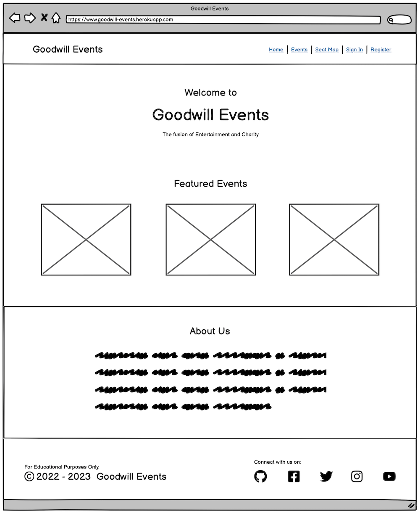
    * Tablet
    
    * Mobile Screen     
    
* **EVENTS** Page       
    
* **SPECIFIC EVENT** Page       
    * Logged In     
    
    * Logged Out
    
* **SEAT MAP** Page     
    
* **SEAT RESERVATION** Page     
    
* **MY ACCOUNT** Page       
    
* **MY RESERVATIONS** Off Canvas        
    
* **SIGN IN** Page      
    
* **REGISTER** Page     
    
* **SIGN OUT** Page     
    
* **CHANGE PASSWORD** Page      
    
* **RESET PASSWORD** Page       
    
* **CONFIRM DELETE RESERVATION** Off Canvas     
    

[Back to Table of Contents](#table-of-contents)

### **SURFACE**

#### **Colors & Contrast**     
Using the Contrast Grid from [Eightshapes.com](https://contrast-grid.eightshapes.com/), 
compliance with the WCAG 2.0 Minimum Contrast was adhered to when mixing and matching the different colours for the project.        
    
* **FOR ALL PAGES (Except Seat Reservation page)**      

* **FOR SEAT RESERVATION (EVENT SEATING) PAGE**     
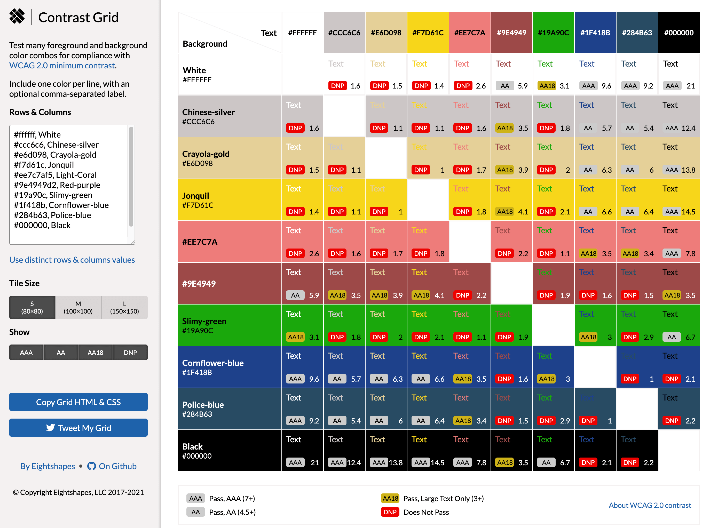       

#### **Typography**        
The following [Google Fonts](https://fonts.google.com/) are used on this project:   

[Back to Table of Contents](#table-of-contents)

## Features
**BASE TEMPLATE with Navbar and Footer**    
> **[User Story](https://github.com/marked-gil/goodwill-events/issues/13):** As a Developer, I can use a base template that contains the header with logo, navbar menu, a `block content` tag,  and general footer so that I can connect it to other HTML pages.

The 'base template', which contains the navbar and footer, is included in all the other templates of the site. The default footer is enclosed in a block tag so it can be modified on other pages where necessary, such as on the 'Seat Reservation' page. It also includes a `block content` tag inside which specific content for each page can be included.

* **Navbar**    
    The navbar is in the header of all the site’s pages. It contains the title logo of the website - Goodwill Events, and the navbar menu.

    For non-logged-in users, the navbar menu consists of the 'Home', 'Events', 'Seat Map', 'Sign In', and 'Sign Up' links; while for the logged-in users, it consists of the 'Home', 'Events', 'Seat Map', 'Sign Out', and 'My Account' links.

    

* **Footer**    
    The footer on most pages, except on the 'Seat Reservation' page, simply contains the site title, copyright and the social media icons, which are links to the social media sites.

    

**HOME Page**
> **[User Story](https://github.com/marked-gil/goodwill-events/issue):** As a User, I can see the home page of the site so that I will know what the website is for.   

The Home page includes the base template as described above and displays three (3) featured events, and the ‘About Us’ section.

    

**FEATURED EVENTS**
> **[User Story](https://github.com/marked-gil/goodwill-events/issues/22):** As a user, I can see the featured list of events on the home page so that I can immediately see the events that are coming up.

There are three (3) featured events displayed in the Home page. These events are automatically selected based on their show dates relative to today. Each featured event is in a card container and displays the event's image, title, its show date and time. Each card is clickable and will redirect to the specific event's full detail page.

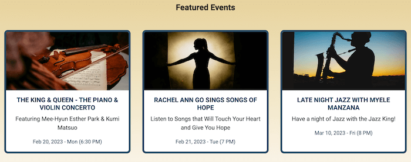    

**UPCOMING EVENTS PAGE (List of All Events)**
> **[User Story](https://github.com/marked-gil/goodwill-events/issues/23):** As a user, I can see all the upcoming events so that I can decide which one interests me.

The Upcoming Events page displays the list of all the upcoming events. This page is paginated, and only five (5) events are displayed per page. 

Each item (event) in the list is presented as a card and shows a featured image, event title, date and time, a reserve button, and the number of likes. Also, each card is clickable and will redirect the site to the specific event’s page. The 'reserve' button, on the other hand, will redirect to the 'Seat Reservation' page.

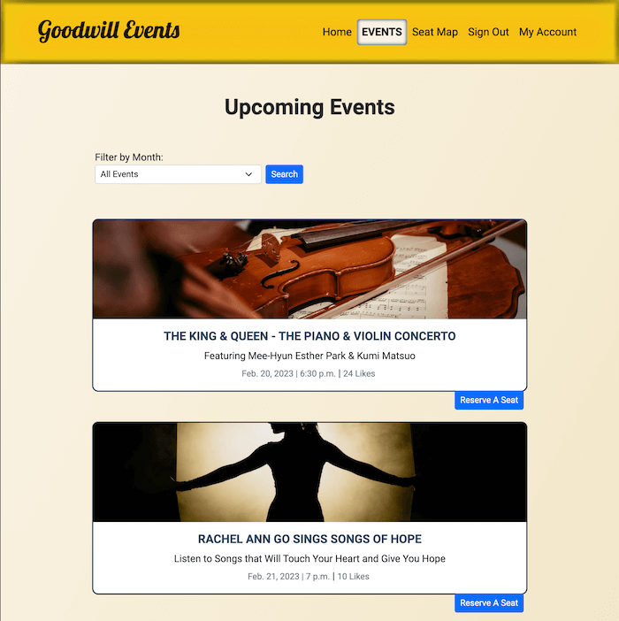   

**EVENTS FILTERING**
> **[User Story](https://github.com/marked-gil/goodwill-events/issues/41):** As a User, I can filter all the events by month so that it is easy and convenient for me to choose an event.

On the Events page, users can filter the events by month using the available filter bar. In case no events are scheduled for the selected month, a message "No Events Found" will be displayed. Additionally, if the user attempts to filter events using an invalid search term or value in the browser's address bar, a message "Invalid query" will be displayed.

**SPECIFIC EVENT PAGE**   
> **[User Story](https://github.com/marked-gil/goodwill-events/issues/24):** As a user, I can view the full detail of the event so that I can learn more about the event.

The specific event’s page displays the details of an event. It shows the event title, its schedule, the number of seats still available, a ‘Reserve a Seat’ button, a ‘LIKE’ button, the event’s description or call-to-action writeup, and a comment section.

The 'Reserve a Seat' button, when clicked, will redirect the user to the event's 'Seat Reservation' page.

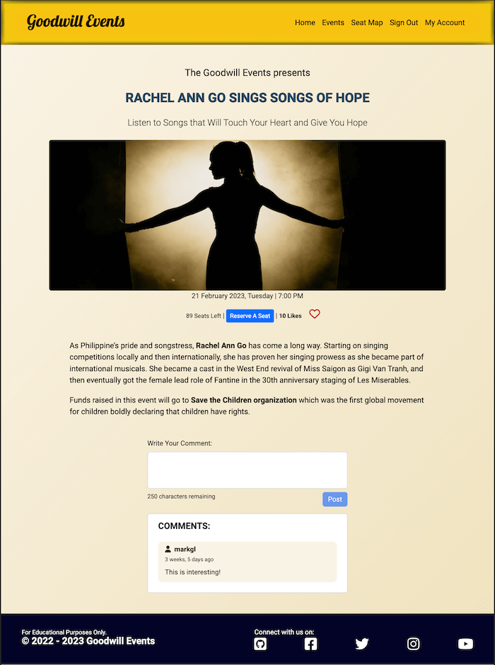     

**EVENT LIKES**
> **[User Story](https://github.com/marked-gil/goodwill-events/issues/25):** As a user, I can like an event post that interests me so that I can show my support for the event.    

The 'Like' button on the specific event's detail page is a red-coloured heart icon, which can be toggled. A hollow heart icon means the user has not liked the post yet, while a colour-filled heart icon denotes otherwise.

The number of likes for an event is displayed on the 'Upcoming Events' page and the specific event's detail page. 

**POSTING COMMENTS**
> **[User Story](https://github.com/marked-gil/goodwill-events/issues/31):** As a user, I can leave a comment on the event page so that I can share my thoughts to the public about a particular event.

Inside the specific event's page, a comment section is located after the event's write-up. For logged-in users, a text area is available for them to type in their comments. Each comment is limited to 250 characters, and a real-time character counter is available to guide the user. When the user submits their comment by clicking on the 'Post' button, the comment will be saved to the database and displayed on the same page.

Non-logged-in users, on the other hand, will only see the comments posted by other users but cannot post comments themselves.

**DELETING COMMENTS**
> **[User Story](https://github.com/marked-gil/goodwill-events/issues/32):** As a user, I can delete my comments on a particular event so that they are no longer visible to the public.

Logged-in users are allowed to delete their posted comments on an event. When a signed-in user visits an event's specific page, a 'Delete' button are displayed beside each of their comments on the 'Comment' section. Once the user clicks on the button, the corresponding comment will be deleted from the database and from the page.

**SEAT MAP PAGES**
> **[User Story](https://github.com/marked-gil/goodwill-events/issues/26):** As a user, I can visit the Seat Map page so that I can see the seat map of the venue.

* **Generic Seat Map** (Seat Map page)      
The 'Seat Map' page shows the generic seat map for all the events. This SVG seat map can be panned and zoomed, but reservation cannot be made on this page. It’s main purpose is only to show the seating arrangement in the venue.

* **Specific Event's Seat Map**    
The 'Seat Reservation' page (or specific event's seating page) contains the interactive SVG seat map, which can be panned and zoomed. In addition, the seats, as represented by the small boxes in the SVG map, can be toggled to select or deselect. Also, the selected or reserved seats can be updated and deleted.  
The gray small boxes represents 'available' seats, the blue ones are reserved or 'unavailable' seats, and the green boxes are the current user's 'selected' seats.
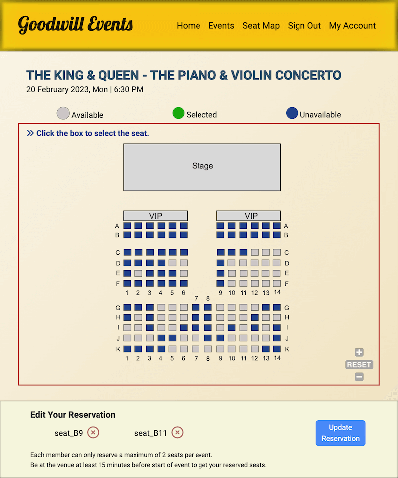

**RESTRICTING SEAT RESERVATION TO SIGNED-IN MEMBERS ONLY**
> **[User Story](https://github.com/marked-gil/goodwill-events/issues/27):** As a user, I can register as a member and sign in so that I can reserve seats.

The event's specific 'Seating' or 'Seat Reservation' page can only be accessed by logged-in users. When a non-logged-in user attempts to access it by clicking on a ‘Reserve a Seat’ button, they will instead be redirected to the Sign In page with a flash message stating 'You need to sign in to make seat reservations'. And once they sign in, they will be redirected back to the 'Seat Reservation' page for the specific event.

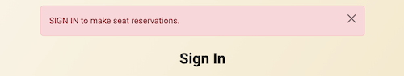

**SELECTING SEATS**
> **[User Story](https://github.com/marked-gil/goodwill-events/issues/28):** As a user, I can select a seat so that I can choose the available seat I want for the event.

In the 'Seat Reservation' page for a particular event, which only signed-in users can access, the SVG seat map's small boxes can be toggled (selected or deselected). When selected, the grey box will turn green; and when deselected, it will turn back to grey. The blue boxes, on the other hand, cannot be clicked as they are already 'reserved' or 'unavailable'. However, if the blue boxes are the reservations made by the current user, then they can be updated or deselected by clicking the 'cancel' button (x button) at the page footer.

Only a maximum of 2 seats can be selected and reserved by a user per event. If the user attempts to select more than two (2) seats, a feedback message stating `You've reached the maximum of 2 seats per user` will be flashed.

The seats selected by the user are displayed at the footer of the page.

**SEAT RESERVATION**
> **[User Story](https://github.com/marked-gil/goodwill-events/issues/29):** As a user, I can reserve the selected seat/s so that they are saved in the database.

In the 'Seat Reservation' page, when the user clicks the 'Reserve' button the selected seats will be saved in the database, the page will reload, turn the selected SVG boxes to blue and flashes a feedback message that states `New seats are reserved`.

**CANCELLING AND UPDATING RESERVED SEATS**
> **[User Story](https://github.com/marked-gil/goodwill-events/issues/30):** As a user, I can cancel and/or update my reserved seats so that other users can reserve the seats or I can conveniently change my preference.   

When a logged-in user already has reserved seat/s for an event, the seat map is disabled by default. For the user to edit their reservation, they need to click the 'Edit Reservation' button, which will enable the seat map's interactivity and allow updating and cancelling of reservations.

If the user wants to change their reserved seats, they have to cancel a seat first if two (2) seats have already been reserved before they can select another seat. Only a maximum of two (2) seats are allowed per user per event. And to update the database of the changes, the user needs to click the 'Update Reservation' button. This button is disabled if there are no changes made to the reservation.

If a user wants to delete their reservation, this can simply be done by cancelling all the reserved seats and clicking the ‘Update Reservation’ button. After which an offcanvas lightbox will appear with a button for the user to click to confirm the deletion.

**SIGN IN PAGE**
> **[User Story](https://github.com/marked-gil/goodwill-events/issues/20):** As a user, I can sign in when I am registered so that I can access the full functionality of the website.

On the Sign In page, utilizing the 'django-allauth' library, the user is required to provide their username and password to log in. Also, if the user wishes to be automatically signed in on their next visit, provided they don’t sign out after their current site visit, then there is a 'Remember Me' checkbox for them to tick.

For users who happen to visit the Sign In page but actually still have not signed up or registered on the website previously, a link is provided for them to be redirected to the Sign Up page. And if the user realizes that they have forgotten their password, a Forgot Password link is on display for them to click and be redirected to the Password Reset page.

Feedback messages are flashed when the user is successfully signed in, and when provided credentials are invalid.

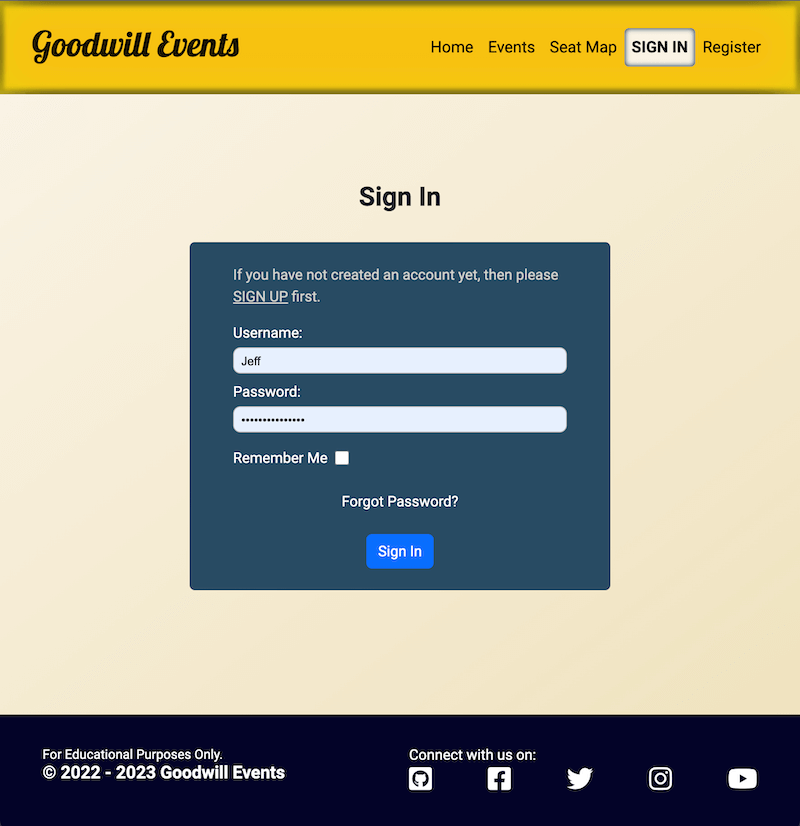

**REGISTRATION (SIGN UP) PAGE**
> **[User Story](https://github.com/marked-gil/goodwill-events/issues/19):** As a user, I can sign-up on the website so that I can be a member and use the full functionality of the website.

The Registration or Sign Up page requires the user to provide a username, first name, last name, email address, and password. The password has to be supplied twice for certainty of user’s intended password. The validation of these fields are provided by Django-Allauth.

If the user visiting the Sign Up page realizes that they have already registered previously, a 'Sign In' link is available on the page for the user to click and be redirected to the Sign In page.

**MEMBER ACCOUNT PAGE (My Account Page)**
> **[User Story](https://github.com/marked-gil/goodwill-events/issues/36):** As a User, I can view all of my account information/data as a registered member so that I can review them as needed.

The 'Member Account' page (My Account page) displays the user's username, first and last names, and email address. These fields are editable, except for the username.

A list of all the active reservations can also be accessed via the 'View My Reservations' button, which reveals an offcanvas containing the list.

A link to change password is also available on the page.

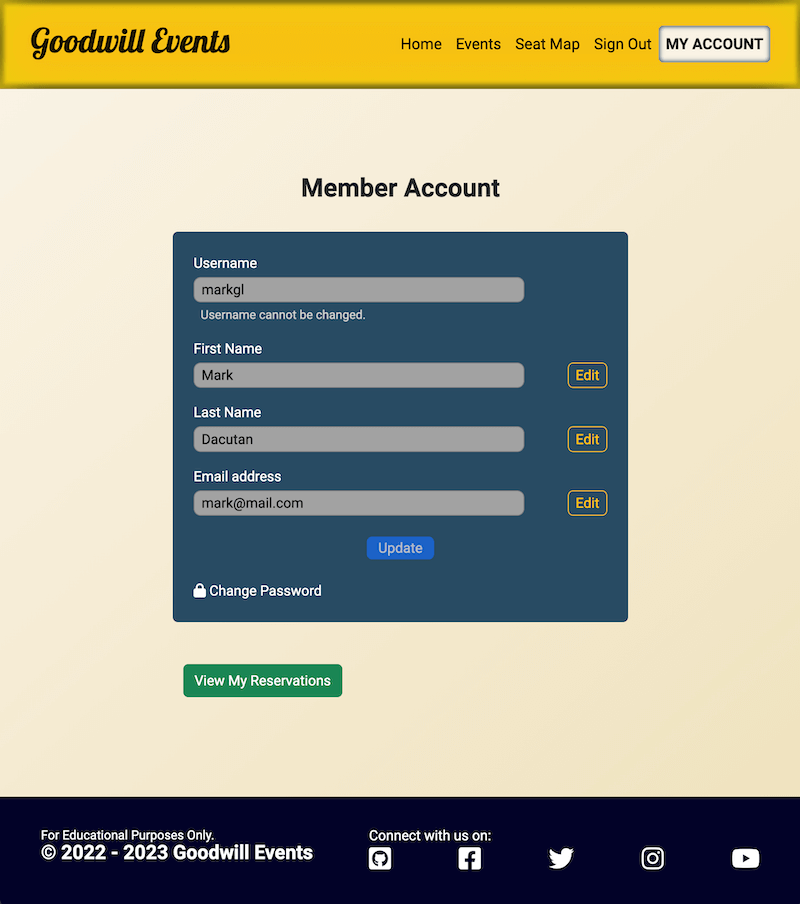

**EDITING ACCOUNT INFORMATION**
> **[User Story](https://github.com/marked-gil/goodwill-events/issues/37):** As a User, I can edit my personal information/data such as first name, last name, and email address so that I can update them easily as necessary.

On the 'Member Account' page, the signed-in user is allowed to change or update their account profile, which includes their first name, last name, and email address. The username, however, cannot be changed.

* 'Edit' button - enables editing of its corresponding input field (By default, each field is read-only)
* 'Update' button - updates the database with the changes made by the user (This button is disabled by default, and will only become active when changes have been made in any of the input fields)

If the user also wants to change their password, a link to Change Password is on this page for the user to click.

**SIGN OUT PAGE**
> **[User Story](https://github.com/marked-gil/goodwill-events/issues/21):** As a user, I can sign out after logging in so that I can protect my website account and prevent unauthorised persons from accessing it.

The Sign Out page’s purpose is to require the user to confirm that they intend to sign out from the website. A 'Sign Out' link is available in the navbar menu when the user is signed in, and a 'Sign Out' button is available on the page to confirm.

A feedback message stating 'You have signed out' is flashed when the user is successfully signed out.

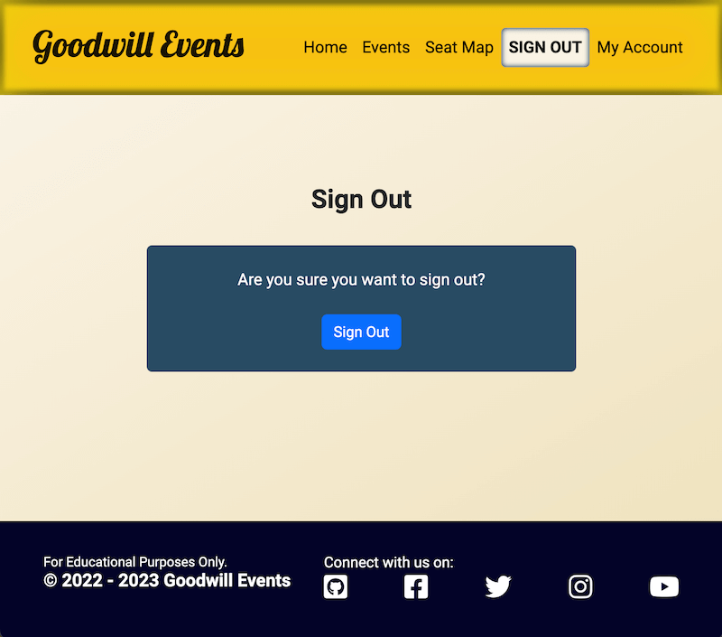

**CHANGE PASSWORD**
> **[User Story](https://github.com/marked-gil/goodwill-events/issues/38):** As a User, I can change my password so that I can maintain the security of my account.

The 'Change Password' page requires the current password and new password (which needs to be entered twice) to be supplied. Then, a 'Change Password' button is available for clicking to process the request. If the current password provided is correct, then the password will be successfully changed in the database. Validation of this feature is provided by 'django-allauth' library.

A link to reset the password is also available through the Forgot Password link.

**PASSWORD RESET**    
> **[User Story](https://github.com/marked-gil/goodwill-events/issues/39):** As a User, I can reset my password so that I can either keep my account secured or keep using my account when I have forgotten my password.

In this page, the user is only required to supply their registered email address where the site will automatically send an email with a link. Once this email is received by the user and they click on the link, the user will be redirected to a page where they can set their new password.

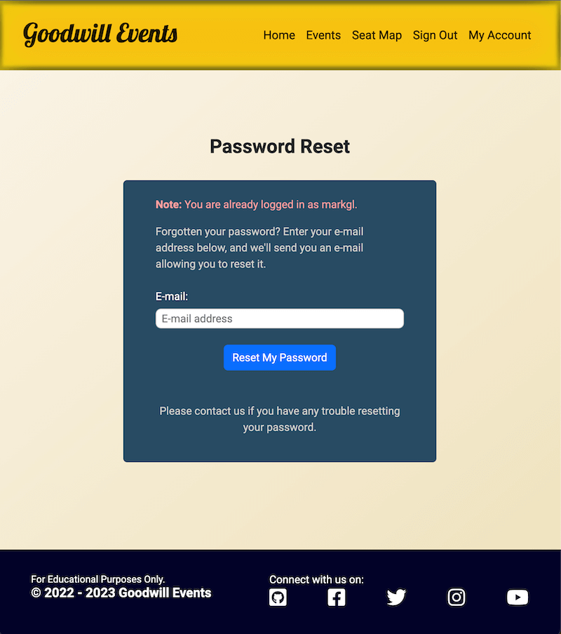

**AUTOMATIC RECYCLING OF EXPIRED EVENTS**
> **[User Story](https://github.com/marked-gil/goodwill-events/issues/34):** As a site owner, I can set an expired event to automatically be recycled to a new scheduled date so that the site can perpetuate despite its contents not being monitored and updated manually.

As this website is for educational purposes and none of the events shown in this project exists in reality, as soon as an event's date has passed, the site is programmed to automatically update its date to the following year. Also, all its reserved seats, likes and comments are deleted for a fresh start. This is designed to allow the perpetuation of the site without overseeing it regularly.

[Back to Table of Contents](#table-of-contents)

## Features Left for Future Implementation

The following **User Stories** have not been implemented in the current state of the project and will be considered for future implementation.

* User Story: [**Confirmation Email for Reserved Seats**](https://github.com/marked-gil/goodwill-events/issues/35)
    > As a user, I can receive a confirmation email for my seat reservation so that I can ensure that my seat reservation to an event is confirmed.     

   **Implementation:**  
   * Set up automatic email function
   * Display a flash message to the user that a confirmation has been sent to his email    

* User Story: [**Modify User Model**](https://github.com/marked-gil/goodwill-events/issues/18)
    > As a developer, I can add other fields in the User model in addition to those that are built-in so I can customize the sign-up and sign-in features of the site.   

   **Implementation:**  
   * Modify the User model to include: telephone number, date of birth, gender, address, and/or etc
   * Require all fields in the User Model

## Fixed Bugs

* ISSUE:    
    Whenever a comment was posted in the Comment section, the page would reload and go back to the top of the page. As the comment section is at the lower part of the page, the user then had to scroll back down to see the displayed comment on the Comment section. This did not seem to provide a good user experience.
    * INTENDED OUTCOME:     
        Every time a comment is being posted by the user, the comment should be displayed without the page having to go back to the top. If page reload is necessary after every post, it should still stay at the comment section to display the posted comment to the user.
    * SOLUTION:     
        I used JQUERY & AJAX to submit and display or delete the comment. And, when the comment is successfully posted or deleted, the site is reloaded using `location.reload()` to bring the site back to the comment section after reloading.   

* ISSUE:    
    I customized django-allauth's `login` template by adding the form fields individually, but it caused the error messages not to show up.
    * INTENDED OUTCOME:     
    I want django-allauth's default error messages to still show up in the `login` template as it normally would before the template was customized.    
    * SOLUTION:     
    Using [stackoverflow's](https://stackoverflow.com/questions/53320056/django-allauth-display-all-error-messages) suggestion, I added this code in the `login` template:  
    ` `     
    ``   
    `{{ key }}`   
    ``     
    `{{ value }}`     
    ``

## Bugs Left To Fix
After extensive manual testing of the site, there were NO BUGS found.

[Back to Table of Contents](#table-of-contents)

## Testing
A combination of **Manual Testing** and **Python Automated Testing** were used in the development of this project. To view all the tests performed, kindly click this [LINK](https://github.com/marked-gil/goodwill-events/blob/main/TESTING.md), which redirects to TESTING.md.

## Deployment

### **Version Control**

**Git** was a crucial tool used to track changes that were made in the repository. The following git commands were mainly used in developing this program:

* `git status` — to show the status of the repository by displaying the files that have been staged and are ready for commit, those that are not, and those that are untracked. 
* `git add <file name>` — to add file or changes in the file to the staging area before they can be committed
* `git commit -m "message"` — to add/record files or changes to the local repository
* `git push` — to upload the local repository to the remote repository, such as GitHub

### **Heroku Deployment**

This website is published on Heroku. The following were the steps I took for this project's deployment.

1. I logged in to my Heroku account.
2. Then, I was redirected to this URL https://dashboard.heroku.com/apps. Inside, I clicked the 'New' button which was a dropdown menu. Between the two (2) options it showed, I clicked on 'Create new app'.
3. Then, on the 'Create New App' page, I typed in my 'app name' and 'region' on their respected input fields. Then I clicked the 'create app' button that is sitting at the bottom of the aforementioned fields. This then redirected me to my new app's page in Heroku.
4. On my new app's page, there is a row of links, which includes: Overview, Resources, Deploy, Metrics, Activity, Access, and Settings. I first went to 'Settings' by clicking its link. 
5. Inside the 'Settings', I clicked on 'Reveal Config Vars' and added the variables and corresponding values that are also found in my env.py file, then clicked on the 'add' button beside them.   
    > The following are the variables in the **Heroku Config Vars**:    
        * CLOUDINARY_URL    
        * DATABASE_URL  
        * EMAIL_ADD     
        * SECRET_KEY    
        * SENDGRID_API_KEY  
6. Then, on the 'Buildpacks' section, I clicked the 'Add buildpack' button and added heroku/python.
7. Then, I went to the 'Deploy' link and clicked on Github as the Deployment Method.
8. Below the Deployment Method section is the Connect to Github section. Here I searched for the name of my new app on Github using the search input field provided. When the name of the repository was displayed, I clicked on the 'connect' button.
9. After a few minutes, it revealed a button to view the deployed website. [View Live Website.](https://goodwill-events.herokuapp.com/)

### **Cloning from GitHub**

To clone the repository for this site, do the following steps:

1. Go to this URL: https://github.com/marked-gil/goodwill-events
2. Inside the repository, look for the button labelled as 'Code', which is along the rows with other buttons such as 'Go to file' and 'Add file'.
3. Click on the 'Code' button, and a small popup box will show up with a top heading of 'Clone'.
4. In the popup box, click on the 'HTTPS' link and copy the URL just below it.
5. Then, go to your computer's terminal and type git clone https://github.com/marked-gil/goodwill-events
6. A copy of the repository is now saved on your computer.

[Back to Table of Contents](#table-of-contents)

## Technologies
This project uses the following tools:
* Frontend Mark Up Language
    * HTML
* Frontend Programming Languages:
    * CSS, Javascript 
* Backend Programming Language:
    * [Python](https://www.python.org/)
* Web Framework:
    * [Django](https://www.djangoproject.com) - web framework used in developing this project
* Deployment Platform:
    * [Heroku](https://www.heroku.com) - the cloud platform used for deployment of the website
* Media and Asset Storage:
    * [Cloudinary](https://cloudinary.com/) - where the assets of this project, including photos are stored
* Database:
    * [ElephantSQL](https://www.elephantsql.com/) - serves as the PostgreSQL database for this project
* Modules and Libraries:
    * [Bootstrap](https://getbootstrap.com/) - frontend toolkit used to help build this responsive site faster
    * [JQUERY](https://jquery.com/) - a feature-rich Javascript library used, along with **AJAX**, to post and delete comments
    * [SVG-PAN-ZOOM library](https://github.com/bumbu/svg-pan-zoom) - used to add the pan and zoom functionality to the SVG seat map.
    * [Hammer.js](http://hammerjs.github.io/) - used to move the seatmap by recognizing gestures made by touch, mouse and pointer events.
    * `OS` module in Python - used in the `settings.py` file to perform functions that involve the operating system, such as checking for environment variables
    * [datetime module](https://docs.python.org/3/library/datetime.html) - used to determine the expired events and manipulating their dates for recycling
    * [django-database-url](https://pypi.org/project/dj-database-url/) - used for connecting Django to database
    * [django-allauth](https://django-allauth.readthedocs.io/en/latest/installation.html) - used for user authentication and registration.
    * [django-summernote](https://github.com/summernote/django-summernote) - used to embed a WYSIWYG editor in the admin panel for the event post.
* [Sendgrid](https://sendgrid.com/) - used in sending emails to users without having to maintain email servers. In this project, it sends password reset link via email to users who has forgotten their password
* [Google Fonts](https://fonts.google.com/) - font provider of the site
* [Miniwebtool](https://miniwebtool.com/django-secret-key-generator/) - as Django secret_key generator
* Git - as a version control system, was used to monitor and record changes made when building the site. This allowed for the restoration of an earlier version of the code when it was necessary
* Gitpod - the cloud-based IDE (Integrated Developer Environment) used to code this site
* GitHub - stores the source code repository for this website
* [Balsalmiq](https://balsamiq.com/) - used in creating the wireframes of this project's design 
* [BOXY-SVG](boxy-svg.com) - an online editor for SVG files, which was used to create the SVG seat map
* [Diagrams.net](https://www.diagrams.net) - used to create the database schema diagram
* [Favicon](https://favicon.io/) - Favicon generator    
* [Font Awesome](https://fontawesome.com/) - provides the social media icons on the page footer
* [Loading.io](https://loading.io/) - provides the free 'loading' SVG animation used on the Seat Reservation page as hint for a request in progress, such as reserving, updating, or deleting seats
* [TinyPNG](https://tinypng.com/) - for image compression
* [Diffchecker](https://www.diffchecker.com/#) - used when comparing codes tested in another IDE to the codes in gitpod     
* [Grammarly](https://www.grammarly.com/) - used to check the grammar of the contents in this project   
* Web browsers (Google Chrome, Firefox, Safari, Microsoft Edge) 
* For Testing and Validation:   
    * [CI Python Linter](https://pep8ci.herokuapp.com/) 
    * [JSHint](https://jshint.com/) 
    * [W3C Markup Validator](https://validator.w3.org/)    
    * [W3C CSS Validator](https://jigsaw.w3.org/css-validator/) 
    * Safari Accessibility Audit    
    * [a11y Color Contrast Accessibility Validator](https://color.a11y.com/)    
    * [WAVE - Web Accessibility Evaluation Tool](https://wave.webaim.org/)
    * Lighthouse Testing
    * [Mobile-Friendly Test](https://search.google.com/test/mobile-friendly)

[Back to Table of Contents](#table-of-contents)

## Credits

### Content
The events and their writeups or blogs on this site are fictional and composed by me - the owner of the site. And most of these events were inspired by the shows in [Royal Albert Hall](https://www.royalalberthall.com).

### Media

* The **images** shown on this site are taken from the following sites:
    * [Unsplash](https://unsplash.com/) 
    * [Pexels](https://www.pexels.com/) 
    * [Wikimedia Commons](https://commons.wikimedia.org/wiki/Main_Page) 

* The **loading SVG animation** was downloaded from [Loading.io](https://loading.io/).
* The **favicon** was generated by [Favicon](https://favicon.io/).
* The icons, such as the social media icons, came from [Font Awesome](https://fontawesome.com/).    

### References
* Main References:
    * [Code Institute](https://codeinstitute.net/ie/)
    * [Django Documentation](https://docs.djangoproject.com/en/3.2/)    
    * [Bootstrap Documentation](https://getbootstrap.com/docs/5.2/getting-started/introduction/)
    * [Jquery Documentation](https://jquery.com/)
    * [W3Schools](https://www.w3schools.com/)
    * [MDN Web Docs](https://developer.mozilla.org/en-US/)
    * [django-allauth Documentation](https://django-allauth.readthedocs.io/en/latest/installation.html)     

* Creating a 404 Error Page - [GeeksforGeeks](https://www.geeksforgeeks.org/django-creating-a-404-error-page/)  

* How to Display Django-Allauth's Error Messages on Customized template - [Stackoverflow](https://stackoverflow.com/questions/53320056/django-allauth-display-all-error-messages)   

* Django Get Comment Without Page Refresh Using jQuery Ajax - [Plus Geek's Youtube Channel](https://www.youtube.com/watch?v=I84MEWdDY20&list=WL&index=60&t=128s)    

* How to Display a Comment Without Page Refresh - [Stackoverflow](https://stackoverflow.com/questions/49628116/how-to-display-a-comment-after-posting-it-without-page-refresh-in-django)

* Function that Checks if a String Contains Only Spaces in JS (used in the site's Comment section) - [bobbyhadz.com](https://bobbyhadz.com/blog/javascript-check-if-string-contains-only-spaces#:~:text=To%20check%20if%20a%20string%20contains%20only%20spaces%2C%20use%20the,only%20spaces%20and%20false%20otherwise)

* Redirecting to the same page after post method - [StackOverflow](https://stackoverflow.com/questions/39560175/redirect-to-same-page-after-post-method-using-class-based-views)

* Django Testing Tutorial - [Cryce Truly Youtube Channel](www.youtube.com/watch?v=FLVB_HruIjk&t=306s)

As a beginner in web development, I conducted extensive research on available resources and materials online to increase my understanding of the programming languages, libraries, and technologies used in this project. While I cannot name all the sites I visited and read, I would like to acknowledge and express my gratitude to the experienced developers who have shared their knowledge and expertise online, helping beginners like me with their brilliant contributions.

[Back to Table of Contents](#table-of-contents)

## Acknowledgment
With profound gratitude, I would like to mention the following:
* **Daisy McGirr**, my Code Institute mentor, for her generosity in sharing her expertise and guiding the creation of this project.
* **Kyle Dacutan**, my wife, for her constant support, love, and understanding.
* And my children, **Zsyrish** and **Marko**, who continue to be my joy and inspiration.