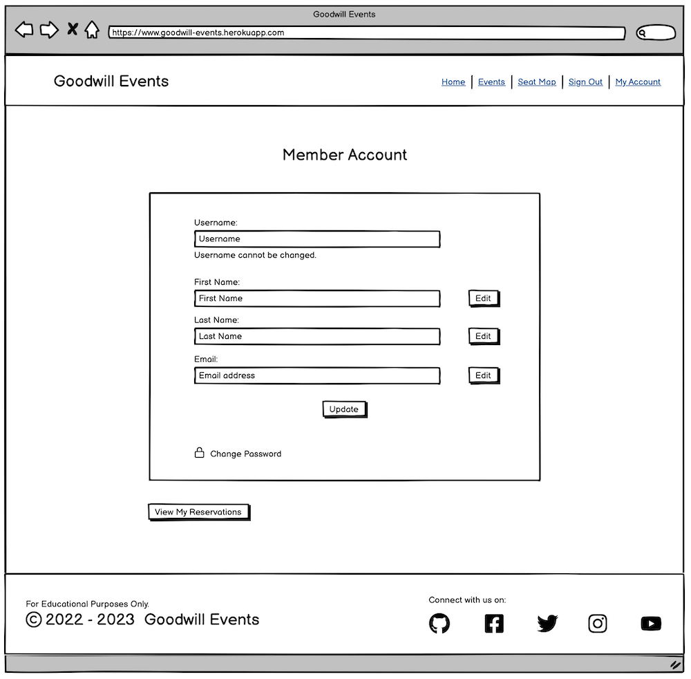
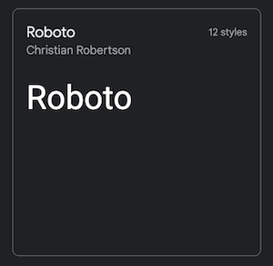

# Goodwill Events
<!-- Screenshot here -->
**Goodwill Events** is a fictional charity organization that produces events, such as concerts, recitals, dance performances and the like for the purpose of entertainment and most especially for charity. And, this website is created to register new members to the organization, show upcoming events, and allow reservation of desired seats for an event by members. In addition, signed-in users of the website can also like and leave comments on individual event posts. [View Live Website.](https://goodwill-events.herokuapp.com/)

## TABLE OF CONTENTS
* [User Experience Design (UXD)](#user-experience-design-uxd)
    * [Strategy](#strategy)
        * [Main Goal](#main-goal)
        * [Target Audience](#target-audience)
        * [EPICS](#epics)
        * [User Stories](#user-stories)
    * [Scope](#scope)
        * [Planned Features](#planned-features)
        * [Design Choice](#design-choice)
    * [Structure](#structure)
    	* [Interaction Design](#)
    * [Skeleton](#skeleton)
        * [Database Schema](#database-schema)
        * [Wireframes](#wireframes)
    * [Surface](#surface)
* [Features](#features)
* [Fixed Bugs](#fixed-bugs)
* [Bugs Left To Fix](#bugs-left-to-fix)
* [Testing](#testing)
* [Deployment](#deployment)
* [Technologies](#technologies)
* [Credits](#credits)
* [Acknowledgment](#acknowledgment)

## User Experience Design (UXD)

### STRATEGY
#### **Main Goal:**
This website aims to showcase 'upcoming' charity shows and events by the fictional organization called ‘Goodwill Events’. And it provides numerous conveniences to philanthropists, such as its online membership registration and seat reservation features. It also allows members to leave comments and likes on specific upcoming events.

#### **Target Audience:**
* Philanthropists or people who are interested in charity work, and are willing to support the cause of a charity organization.     
* People who enjoy attending concerts and shows for its entertainment value.
* People who prefer convenience when attending events by being able to choose and reserve preferred seat/s ahead of time.
* People who like to feel involved and able to show support to a specific event by commenting and liking an event post.

#### **The Use of Agile Methodology**
This project was created using the Agile Methodology. At the start of the project, 9 EPICS were formed to guide the design, structure, and the process of constructing the website. Under each epic are several User Stories that specify the features of the project. And each User Story was assigned a story point  ( ie, 2 - 8 points) and a priority label (ie, Must-Have, Should-Have, Could-Have, and Won’t-Have). The story points for each User Story guided the creator to estimate the time needed to implement the feature, while the priority labels allowed the creator to implement first the most vital components of the site to make it a viable product quicker.

Also, each User Story includes acceptance criteria, which are the basis of whether the User Story has been implemented successfully or not. And in order for the creator to fulfill them successfully, tasks are specified for the creator to implement.

In total, there are 30 User Stories formulated for this project - 28 have been implemented, and the remaining 2 are left for future implementation. These 28 implemented User Stories were divided among the 4 planned iterations. However, each iteration has been given a different timeframe as the owner and creator of this site has his time constrained by other professional obligations.

Github’s Kanban board is an extremely useful feature that this project used. Through it , tasks were marked conveniently when done, and User Stories were closed when fulfilled. Here is the link for the project’s Kanban board - [CLICK HERE](https://github.com/users/marked-gil/projects/15).

#### **EPICS:**
1. [Initial Django Setup](https://github.com/marked-gil/goodwill-events/issues/1)
2. [Heroku Setup](https://github.com/marked-gil/goodwill-events/issues/2)
3. [Data Models](https://github.com/marked-gil/goodwill-events/issues/3)
4. [Initial Templates](https://github.com/marked-gil/goodwill-events/issues/4)
5. [User Membership](https://github.com/marked-gil/goodwill-events/issues/5)
6. [Events](https://github.com/marked-gil/goodwill-events/issues/6)
7. [Event Seating](https://github.com/marked-gil/goodwill-events/issues/7)
8. [Comments](https://github.com/marked-gil/goodwill-events/issues/8)
9. [Expired Events Management](https://github.com/marked-gil/goodwill-events/issues/9)

#### **User Stories:**
Iteration 1:    
* Initial Dependencies Installation ([Epic 1](https://github.com/marked-gil/goodwill-events/issues/1))
* Basic Skeletal Structure of the Project ([Epic 1](https://github.com/marked-gil/goodwill-events/issues/1))
* Initial Deployment to Heroku ([Epic 2](https://github.com/marked-gil/goodwill-events/issues/2))
* Basic Home Page Template ([Epic 4](https://github.com/marked-gil/goodwill-events/issues/4))
* Event Model ([Epic 3](https://github.com/marked-gil/goodwill-events/issues/15))
* Basic Base Template ([Epic 4](https://github.com/marked-gil/goodwill-events/issues/13))
* Featured Events List ([Epic 6](https://github.com/marked-gil/goodwill-events/issues/6))
* All Events Page ([Epic 6](https://github.com/marked-gil/goodwill-events/issues/6))
* Specific Event's Page ([Epic 6](https://github.com/marked-gil/goodwill-events/issues/6))

Iteration 2:    
* Sign In ([Epic 5](https://github.com/marked-gil/goodwill-events/issues/5))
* Sign Out ([Epic 5](https://github.com/marked-gil/goodwill-events/issues/5))
* Member Registration ([Epic 5](https://github.com/marked-gil/goodwill-events/issues/5))
* Seating Model ([Epic 3](https://github.com/marked-gil/goodwill-events/issues/16))
* Event Seats Page ([Epic 7](https://github.com/marked-gil/goodwill-events/issues/7))
* Make Event Seat Reservation ([Epic 7](https://github.com/marked-gil/goodwill-events/issues/7))

Iteration 3:    
* Submission of Selected Seats for a Particular Event ([Epic 7](https://github.com/marked-gil/goodwill-events/issues/7))
* Restrict Seat Reservation to Signed-in Members Only ([Epic 7](https://github.com/marked-gil/goodwill-events/issues/7))
* Cancellation Reserved Seats for an Event ([Epic 7](https://github.com/marked-gil/goodwill-events/issues/7))
* Event Likes ([Epic 6](https://github.com/marked-gil/goodwill-events/issues/6))
* Comment Model ([Epic 3](https://github.com/marked-gil/goodwill-events/issues/16))
* Comments Control by Site Owner ([Epic 8](https://github.com/marked-gil/goodwill-events/issues/8))
* User Comments on Upcoming Events ([Epic 8](https://github.com/marked-gil/goodwill-events/issues/8))
* Deleting Comments on Upcoming Events ([Epic 8](https://github.com/marked-gil/goodwill-events/issues/8))

Iteration 4:    
* Create Member Account Page ([Epic 5](https://github.com/marked-gil/goodwill-events/issues/5))
* Allow logged in member to edit their provided personal information. ([Epic 5](https://github.com/marked-gil/goodwill-events/issues/5))
* Allow Change of Password ([Epic 5](https://github.com/marked-gil/goodwill-events/issues/5))
* User can reset their password ([Epic 5](https://github.com/marked-gil/goodwill-events/issues/5))
* Recycling Expired Events ([Epic 9](https://github.com/marked-gil/goodwill-events/issues/9))
* Confirmation Email for Seat Reservation ([Epic 7](https://github.com/marked-gil/goodwill-events/issues/7))
* Modify User Model ([Epic 3](https://github.com/marked-gil/goodwill-events/issues/3))

### SCOPE

#### **Planned Features**

* User Story: **Initial Dependencies Installation**
    > As a Developer, I want the significant dependencies installed first so that I can focus on the functionalities of the site later on.

    * ACCEPTANCE CRITERIA:
        * Django, gunicorn, dj_database_url, psycopg2, and dj3 cloudinary storage are all successfully installed and added to the requirements.txt.
    * TASKS:    
        * Install Django and gunicorn
        * Install dj_database_url and psycopg2
        * Install dj3-cloudinary-storage
        * Add the dependencies to the requirements.txt     

* User Story: **Basic Skeletal Structure of the Project**
    > As a developer, I can see the basic skeletal structure of the project .

    * ACCEPTANCE CRITERIA:
        * The new django project and first app are created and migrated.
    * TASKS:
        * Create the new django project
        * Create initial apps - events
        * Add the apps to the installed apps in settings.py

* User Story: **Initial Deployment to Heroku**
    > As a developer, I can initially deploy the basic and skeletal structure of the project to Heroku so that I can check the initial successful connection to Heroku.

    * ACCEPTANCE CRITERIA:
        * Initial deployment of the project to Heroku is successful.
        * PostgreSQL and Cloudinary are set up.
    * TASKS:
        * Create a new Heroku app
        * Use PostgreSQL
        * Create and set up the env.py
        * Set up the Cloudinary
        * Update Heroku Config vars
        * Update the settings.py
        * Create the directories: media, static, templates
        * Create Procfile
        * Deploy to Heroku

* User Story: **Basic Base Template**
    > As a Developer, I can use an initial base template so that I connect it to other html pages and do initial testing.

    * ACCEPTANCE CRITERIA:
        * The base template is initially set up with header and footer.
    * TASKS:
        *  Create a base template.
        * Create a header with navbar and site name or logo
        * Create a footer that contains the site name, contact details, and social media links.

* User Story: **Basic Home Page Template**
    > As a Developer, I can use a basic home page for the initial creation of the site so that I can initially check if the base template can connect successfully to other pages.

    * ACCEPTANCE CRITERIA:
        * The basic home page template is initially set up and linked with the base template
    * TASKS:
        * Create a basic home page
        * Connect the base template to the basic home page

* User Story: **Event Model**
    > As a Developer, I can save new events into a database table so that I can use the data on the website.

    * ACCEPTANCE CRITERIA:
        * The event model is constructed with fields such as title, slug, blurb, event_date, event_time, content, featured_image, author, entered_by, created_on, updated_on, likes, and etc.
        * The Event model is available on the admin panel.
    * TASKS:
        * Create an Event Model with fields such as: title, slug, blurb, event_date, event_time, content, featured_image, author, entered_by, created_on, updated_on, likes, etc.
        * Modify the built-in string method of Django’s base Model class
        * Install Summernote and use it for the post_content on Event Model
        * Customize the admin interface for the Event class Model
        * Register the Event model in admin.py

* User Story: **Seating Model**
    > As a developer, I can save the seat reservation of a signed-in member on the database so that I can block the specific seat/s of the event for the specific member.

    * ACCEPTANCE CRITERIA:
        * The seating model is constructed with fields such as 'event', 'seat_location', 'reserved_on', and 'reserved_by'.
        * The Seating model is available on the admin panel.
    * TASKS:
        * Create Seating app
        * Create VenueSeat Model
        * Create EventSeating Model with fields such as event, seat_location, reserved_on, and reserved_by
        * Modify the built-in string method of Django’s base Model class
        * Register the VenueSeat and EventSeating models in admin.py

* User Story: **Comment Model**
    > As a developer, I can save the user’s comments into the database so that I can display it in its specific event post.

    * ACCEPTANCE CRITERIA:
        * The comment model is constructed with fields such as text_comment, author, event_post, and posted_on.
        * The Comment model is available on the admin panel
    * TASKS:
        * Create a Comment Model with fields such as text_comment, author, event, and posted_on
        * Modify the built-in string method of Django’s base Model class
        * Register the Comment model in admin.py

* User Story: **Member Registration**
    > As a user, I can sign-up on the website so that I can be a member and use the full functionality of the website.

    * ACCEPTANCE CRITERIA:
        * GIVEN that a registration template is made, WHEN it is opened THEN the registration form - which includes fields for the username, first name, last name, email address, and password - shows up.
        * GIVEN that the registration form is present, WHEN the form is submitted with invalid formats on any of the fields THEN the form is not submitted and a feedback message shows up.
        * GIVEN that the registration form is present, WHEN password is created by the user THEN it will be required to re-enter the same password before the form can be submitted.
        * GIVEN that the registration form is validly completed, WHEN the form is submitted, THEN the user is redirected to the home page.
    * TASKS:
        * Create a registration template
        * Create a form that includes fields for username, first name, last name, email address, and password
        * Validate the form when submitted; and if it is invalid, redirect to the same page and show a feedback message
        * Prevent the submission of the form when the password is not re-entered correctly, and show a feedback message to the user
        * Redirect the user to the home page when registration is validly submitted

* User Story: **Sign In**
    > As a user, I can sign in when I am registered so that I can access the full functionality of the website.

    * ACCEPTANCE CRITERIA:
        * GIVEN the ‘sign in’ form is created and the user is registered, WHEN the user signs in with the required valid username or email address and password THEN the user can access the full functionality of the website.
        * GIVEN the ‘sign in’ form is created, WHEN the user signs in with invalid credentials THEN feedback message is displayed and the form is not submitted.
    * TASKS:
        * Create a ‘sign-in’ page
        * Create a 'sign-in' form that requires the user’s username and password
        * Redirect the user to the home page when sign-in is successful
        * Flash feedback message when sign-in credentials are invalid

* User Story: **Sign Out**
    > As a user, I can sign out when I am already signed in so that I can protect my website account and prevent unauthorised persons from using it.

    * ACCEPTANCE CRITERIA:
        * GIVEN the user is signed in, WHEN the user clicks the sign-out button THEN the user’s session is ended and access to the site is limited to its content that is for general consumption.
        * GIVEN the user is redirected to the home page, WHEN client is signed out successfully THEN the user is redirected to the home page and a feedback message is shown.

    * TASKS:
        * Create a sign-out link on the navbar
        * Redirect to the home page when the sign-out link is clicked
        * Flash a feedback message on the home page when the user is signed out successfully

* User Story: **Featured Events List**
    > As a user, I can see the featured list of events on the home page so that immediately see the events that are coming up.

    * ACCEPTANCE CRITERIA:
        * GIVEN home page is created, WHEN the user visits the home page THEN they can see a list of the featured events.
        * GIVEN featured list of events is displayed, WHEN the user clicked a featured event THEN the full details of the event will be displayed on a separate page.
    * TASKS:
        * Display the upcoming 3 - 4 events on the home page
        * Show title, short description, date and time
        * Add a button for every featured event that redirects to the event's full detail page.

* User Story: **All Events Page**
    > As a user, I can See all the upcoming events so that I can decide which one interests me.

    * ACCEPTANCE CRITERIA:
        * GIVEN template for all events is created, WHEN user visits the ‘all events’ page THEN they can browse all the upcoming events
        * GIVEN the user is visiting the ‘all events’ page, WHEN user clicks an event THEN the site attempts to redirect to another page.
    * TASKS:
        *  Create a template for all the upcoming events
        * Display all the upcoming events in ascending order based on the date of the event
        * Make each event item a clickable element that redirects to another URL
        * Develop pagination

* User Story: **Specific Event’s Page**
    > As a user, I can view the full detail of the event so that I can learn more about the event.

    * ACCEPTANCE CRITERIA:
        * GIVEN the user is on the home page or ‘all events’ page, WHEN the user clicked an event THEN the full details of the event will be displayed on a separate page.
    * TASKS:
        *  Create event template
        * Display the featured banner image of the event
        * Display the description or writeup about the event
        * Display the date and time of the event
        * Add a ‘reserve seat’ button to the event’s page

* User Story: **Event Likes**
    > As a user, I can like an event post that interests me so that I can show my support for the event.

    * ACCEPTANCE CRITERIA:
        * GIVEN the user is signed in and visiting the event’s page, WHEN the user clicks the ‘like’ button THEN it will add to the number of likes of the event post.
        * GIVEN the user is signed in and visiting the event’s page, WHEN the user clicks again the ‘like’ button THEN it will remove their like of the post and update the displayed number of likes of the event post.
    * TASKS:
        * Create a ‘like’ toggle button on the event’s page
        * Display the number of likes of the event post
        * Add the user’s like to the total likes of the event and display it
        * Allow user to remove their ‘like’

* User Story: **Event Seats Page**
    > As a user, I can visit the seating page so that see the available seats I can reserve.

    * ACCEPTANCE CRITERIA:
        * GIVEN the user is signed in, WHEN the user visits the seating page THEN the seat map is displayed.
        * GIVEN the user is signed in, WHEN the user visits the seating page THEN the event’s title, date, and time are displayed.
    * TASKS:
        * Create ‘seating page’
        * Add the seat map on the ‘seating page’
        * Allow the seat map to pan and zoom
        * Display the event’s title, date, and time
        * Display the colour legend for the seat map

* User Story: **Restrict Seat Reservation to Signed-in Members Only**
    > As a user, I can register as a member and sign in so that I can reserve seats.

    * ACCEPTANCE CRITERIA:
        * GIVEN the user is not signed in, WHEN they visit the seating page THEN they are still able to see the seat map and the available seats.
        * GIVEN the user is not signed in, WHEN they attempt to make a reservation THEN they are redirected to the sign-in page with a flash feedback message.
        * GIVEN the un-signed-in user has been redirected to the ‘sign-in’ page from the seating page, WHEN the user signed in THEN the user is redirected back to the seating page.

    * TASKS:
        *  Redirect the user to the sign-in page when the un-signed-in user attempts to book a reservation
        * Flash a feedback message to the user to sign in when redirected to the sign-in page
        * Redirect the user back to the seating page after signing in

* User Story: **Make Event Seat Reservation**
    > As a user, I can reserve a seat so that I can choose the available seat I want and ensure I have a seat during the event.

    * ACCEPTANCE CRITERIA:
        * GIVEN the user is signed in, WHEN I clicked on the available seat on the map THEN it shows on the screen that the user has selected it.
        * GIVEN the user has selected a seat/s, WHEN the user clicks or toggles again on the selected seat/s on the seat map THEN the seats are de-selected.
    * TASKS:
        * Make all available seats active on the seat map and can be toggled
        * Display all unavailable seats as inactive items on the seat map
        * Allow only 2 seats to be reserved per member
        * List all selected seats on the screen
        * Allow de-selection of the seat

* User Story: **Submission of Selected Seats for a Particular Event**
    > As a user, I can submit the selected seat/s so that I can ensure that it is reserved.

    * ACCEPTANCE CRITERIA:
        * GIVEN the signed-in user has selected a seat/s, WHEN I click on the ‘reserve’ button THEN the seats are saved to the database and reserved.
    * TASKS:
        * Add a ‘reserve’ button to proceed with the reservation
        * Save selected seats in database
        * Display a flash message on the seating page when a seat is successfully reserved

* User Story: **Cancellation of Reserved Seats for an Event**
    > As a user, I can cancel my reserved seats so that other users can reserve the seats.

    * ACCEPTANCE CRITERIA:
        * GIVEN the signed-in user has selected a seat/s, WHEN I click on the ‘cancel’ button THEN the selected seat/s are de-selected on the map.
        * GIVEN the user has already reserved a seat/s for an event, WHEN the user visits the event’s seating page THEN the selected seats are displayed.
        * GIVEN the user has already reserved a seat/s for an event, WHEN the user clicks on the ‘Update my reservation’ button THEN the reserved seats can be cancelled and/or replaced.
    * TASKS:
        * Add a ‘cancel’ button to remove the selected seat/s
        * Add an ‘Update my reservation’ button’ to allow the cancellation and/or replacement of the reserved seats.
        * Remove the ‘reserve’ button when the user already has reserved seat/s, and show the list of seats reserved.
        * Allow reserved seats to be cancelled
        * Add an ‘update reservation’ button is clicked.
        * When the ‘update’ button is clicked, the 'seating' database is updated and a feedback message is flashed

* User Story: **User Comments on Upcoming Events**
    > As a user, I can leave a comment on the event page so that I can share my thoughts with the public about a particular event.

    * ACCEPTANCE CRITERIA:
        * GIVEN the user is signed-in, WHEN I add a comment on an event page THEN it will be saved in the database.
        * GIVEN the number of text characters for each comment is limited, WHEN the user adds a comment on an event page THEN the number of characters left is displayed in real-time.
        * GIVEN the user is visiting an event's page, WHEN the user scrolls down to the comment section THEN they can see the comments from members.
    * TASKS:
        * Create a form for comments on each page
        * Limit the comment length to 250 characters
        * Show realtime character counter for comments
        * Save the comment to the database when the ‘submit’ button is clicked
        * Display the comments on the event’s page along with the author's first name and initial of their last name, and the date and time of posting

* User Story: **Deleting Comments on Upcoming Events**
    > As a user, I can delete my comments on a particular event so that they are no longer visible to the public.

    * ACCEPTANCE CRITERIA:
        * GIVEN the user has posted a comment, WHEN the author of the comment is signed-in THEN they are allowed to delete their comments.
    * TASKS:
        * Add a ‘delete’ button on the user’s comment when signed-in
        * Delete the comment when the ‘delete’ button is clicked

* User Story: **Comments Control by Site Owner**
    > As a site owner, I can delete the comments of members so that the site is kept friendly and safe for all users.

    * ACCEPTANCE CRITERIA:
        * GIVEN an inappropriate comment is posted by a user, THEN the site owner can deliberately delete the comment without notice.
    * TASKS:
        *  Delete an inappropriate comment through the admin panel

* User Story: **Recycling Expired Events**
    > As a site owner, I can set an expired event to automatically be recycled to a new scheduled date so that the site can perpetuate despite its contents not being monitored and updated manually.

    * ACCEPTANCE CRITERIA:
        * GIVEN that this site is for educational purposes only and the events may not be monitored or updated regularly, WHEN an event has gone past its schedule THEN it will automatically be rescheduled to a future date.
        * GIVEN that the event has gone past its schedule, WHEN the event is automatically recycled with a new date THEN it is re-displayed with all the other events in the order of their dates.
        * GIVEN that the event has gone past its schedule, WHEN the event is automatically recycled with a new date THEN all its previously reserved seats are deleted for a new start.
    * TASKS:
        * Automatically update the schedule of the event in the database to the following year as soon as it expires
        * Re-display the recycled event with the new schedule
        * Delete all reserved seats for the expired and recycled events

* User Story: **Create Member Account Page**
    > As a User, I can view all of my personal information/data as a registered member so that I review them as needed.
    
    * ACCEPTANCE CRITERIA:
        * GIVEN that I am registered to the site, WHEN I log in THEN I can view all my personal information/data that I have provided to the site.
        * GIVEN that I am registered to the site, WHEN I click on the Member Account Page THEN I will be able to see my registered username, first name, last name, and email
    * TASKS:
        * Create A Member's Account page
        * In the Member's Account page, display the username, first name, last name, and email of the user.

* User Story: **Allow logged in member to edit their provided personal information**
    > As a User, I can edit my personal information/data such as first name, last name, and email address so that I can update them easily as necessary.

    * ACCEPTANCE CRITERIA:
        * GIVEN the user is logged in and inside the Member's Account page, WHEN I edit my personal information/data THEN they are allowed to edit their provided personal information as they see fit.
        * GIVEN the user has edited a specific personal information (eg, first name), WHEN I click save THEN the specific field will be updated in the database.
    * TASKS:
        * Create an edit button for each personal info field
        * Update the database when an edited personal info is saved
        * Do not allow username to be changed.

* User Story: **Allow Change of Password**
    > As a User, I can change my password so that I can maintain the security of my account.
    
    * ACCEPTANCE CRITERIA:
        * GIVEN the user is a logged in member, WHEN they click on 'Change Password' inside the Member's Account page THEN it will allow them to change their password.
        * GIVEN the user has entered a new and verified password, WHEN they click 'save' THEN the database will be updated.
    * TASKS:
        * Create a 'Change Password' button inside the Member's Account page
        * Verify the new password the user entered by asking them to re-enter the same password.
        * Update the database when the new password is verified and saved.

* User Story: **User Can Reset their Password**
    > As a User, I can reset my password so that I can either keep my account secured or keep using my account when I have forgotten my password.

    * ACCEPTANCE CRITERIA:
        * GIVEN that the user is logged in and has provided a valid email address, WHEN they visit the Member's Account page and click on the 'change my password' link an email will be sent to the user to enable them to change his password.
        * GIVEN that the user has previously registered and has provided a valid email address, WHEN they click on 'forgot password?' link inside the Sign In page THEN an email will be sent to user to enable them to change their password.
    * TASKS:
        * Add a 'change my password' link inside the Member's Account page and redirect it to the password reset page
        * Add a 'forgot my password?' link inside the Sign In page and redirect it to the password reset page
        * Send an email to the user with a link to enable them to change their password

* User Story: **Confirmation Email for Seat Reservation** [NOT IMPLEMENTED]
    > As a user, I can receive a confirmation email for my seat reservation so that I can ensure that my seat reservation to an event is confirmed.

    * ACCEPTANCE CRITERIA:
        * GIVEN that the user has selected their seat/s, WHEN they click the ‘reserve’ button THEN an automatic email will be sent to the user as confirmation.
        * Set up automatic email function
        * Display a flash message to the user that a confirmation has been sent to his email
    * TASKS:
        * Set up automatic email function
        * Display a flash message to the user that a confirmation has been sent to his email

* User Story: **Modify User Model** [NOT IMPLEMENTED]
    > As a developer, I can add other fields in the User model in addition to those that are built-in so I can customize the sign-up and sign-in feature of the site.

    * ACCEPTANCE CRITERIA:
        * The User modal is modified to include the telephone_number field, etc.
        * All the fields in the User Model cannot be left blank and will raise a validator error if attempted.
        * The added fields to the User model are available on the admin panel.
    * TASKS:
        * Modify the User model to include: telephone_number, and/or etc
        * Require all fields in the User Model

#### **Design Choice**
* **Color Scheme**:     
The following are the main colors used:     

    **ON ALL PAGES (except Seat Reservation Page)**     
    * #ffffff (White)
    * #F9F3E5 (Linen)   
    * #F0E2BF (Dutch-white)
    * #e6d098 (Crayola-gold)    
    * #E3D7D7 (Timber-wolf)
    * #f7d61c (Jonquil)
    * #f9c012 (Mikado-yellow)
    * #ff9393 (American-pink)
    * #284b63 (Police-blue)
    * #030328 (Rich-black)
    * #000000 (Black)       

    **ON RESERVATION PAGE**
    * #ffffff (White)
    * #ccc6c6 (Chinese-silver)  
    * #e6d098 (Crayola-gold)    
    * #f7d61c (Jonquil)
    * #ee7c7af5 (Light-coral)
    * #9e4949d2 (Red-purple)
    * #19a90c (Slimy-green)
    * #1f418b (Cornflower-blue)
    * #284b63 (Police-blue)
    * #000000 (Black)

    ([See SURFACE section for more details](#surface))      
        
* **Typography**:       
This project uses fonts from [Google Fonts](https://fonts.google.com/). And the following are the fonts used in this project:
    * **Roboto** - the default font for the whole site
    * **Lobster** - the font used to design the text logo       
    ([See SURFACE section for more details](#surface))

### STRUCTURE
<!-- Interaction Design (IXD) -->
<!-- Consistent -->
<!-- Predictable -->
<!-- Learnable -->
<!-- Visible -->
<!-- Provides clear and intuitive Feedback -->

### SKELETON
#### **Database Schema**
The database for the Goodwill Events project is composed of 5 models, of which four (4) are custom models, such as the Event, Comment, VenueSeat, and EventSeating models; while one (1) is a default model from Django - the User model. The database schema shown below, which is a modified snowflake schema, represents the relationship of the models among each other. Also, it provides significant information such as the table names (model names), the fields, and the type of data for each field. (Note: PK stands for 'primary key')

#### **Wireframes**
* **HOME** Page      
    * Desktop       
    
    * Tablet
    
    * Mobile Screen     
    
* **EVENTS** Page       
    
* **SPECIFIC EVENT** Page       
    * Logged In     
    
    * Logged Out
    
* **SEAT MAP** Page     
    
* **SEAT RESERVATION** Page     
    
* **MY ACCOUNT** Page       
    
* **MY RESERVATIONS** Off Canvas        
    
* **SIGN IN** Page      
    
* **REGISTER** Page     
    
* **SIGN OUT** Page     
    
* **CHANGE PASSWORD** Page      
    
* **RESET PASSWORD** Page       
    
* **CONFIRM DELETE RESERVATION** Off Canvas     
    

### SURFACE

* **Colors & Contrast**     
    Using the Contrast Grid from [Eightshapes.com](https://contrast-grid.eightshapes.com/), 
    compliance with the WCAG 2.0 Minimum Contrast were adhered to when mixing and matching the different colors for the project.        
    
    **FOR ALL PAGES (Except Seat Reservation page)**
    

    **FOR SEAT RESERVATION PAGE**
           

* **Typography**        
    The following [Google Fonts](https://fonts.google.com/) are used on this project:   
    
    

## Features
### **HOME** Page
The Home page contains 3 featured events, which have the nearest show dates relative to today’s. Also, it displays the ‘About Us’ section.

<!-- Home Page screenshot here -->

### **NAV BAR**      
The nav bar is in the header of all the site’s pages. It contains the title of the website - Goodwill Events; and the navbar menu.

For non-logged-in users, the navbar menu consist of the Home, Events, Seatmap, Sign In, and Sign Up links; while for the logged-in users, it consist of the Home, Events, Seatmap, Sign Out, and My Account links.

<!-- Nav Bar screenshot here -->

### **FOOTER**
The footer simply contains the title of the site and the icons, which are links to the site’s social media accounts.

<!-- Footer screenshot here -->

### **Events** Page
The Events page displays the list of all the upcoming events. This page is paginated, and there are only 5 events displayed per page. 

Each item in the list is an event which shows a featured image, its title, date and time, a reserve button, and number of likes. Also, each item or event is clickable and will redirect the site to the specific event’s page. The reserve button, on the other hand, will redirect to the Seat Reservation page.

<!-- Events Page screenshot here -->

### **Specific Event** Page
The specific event’s page contains the details of the events. It shows the title of the event, its schedule, number of seats still available, a ‘Reserve a Seat’ button, a ‘LIKE’ button,  the event’s description and/or the performer’s description, and a comment section.

For non-logged-in users, they will only see the comments posted by other users, but cannot post comment themselves; while the logged-in users can post comments.

<!-- Specific Event Page screenshot here -->

### **Seat Map** Page
The Seat Map page shows the generic seat map for all the events of Goodwill Events. This SVG seat map can be panned and zoomed, but reservation cannot be made on this page. It’s main purpose is only to show the seating arrangement in the venue.

<!-- Seat Map Page screenshot here -->

### **Seat Reservation** Page
The Seat Reservation page contains the interactive SVG seat map, which can be panned and zoomed. In addition, the seats, as represented by the small boxes in the SVG map, can be toggled to select or deselect. In addition, the selected or reserved seats can be updated and deleted.

Only logged-in users can be redirected to this page, and they are limited to booking only a maximum of 2 seats per event. When a non-logged-in user clicks on a ‘Reserve a Seat’ button, they will be redirected to the Sign In page; and once they sign in, they will be redirected back to the Seat Reservation page for the specific event.

When a logged-in user deletes their previously booked seats by cancelling all seats and clicking the ‘Update My Reservation’ button, a off-canvas lightbox will come with a button for the user to click to confirm deletion.

<!-- Seat Reservation Page screenshot here -->

### **Sign In** Page
In the Sign In page, the user is required to provide their username and password to be logged-in. Also, if the user wishes to be automatically signed in on their next visit when they don’t sign out after their current site visit then there is a Remember Me checkbox for them to tick.

For users who happens to visit the Sign In page but actually still have not signed up or registered in the website previously, a link is provided for them to be redirected to the Sign Up page. And if the user realizes that they have forgotten their password, a Forgot Password link is on display for them to click and be redirected to the Password Reset page.

<!-- Sign In Page screenshot here -->

### **Register (Sign Up)** Page
The Registration or Sign Up page requires the user to provide a username, first name, last name, email address, and password. The password has to be supplied twice for certainty of user’s intended password. The validation of these fields are provided by Django-Allauth.

If the user visiting the page, realizes they actually have registered previously, a Sign In link is available on the page for the user to click and be redirected to the Sign In page.

<!-- Sign Up Page screenshot here -->

### **My Account** Page
The My Account page is created to allow a user to change or update their account profile, which includes their first name, last name, and email address. However, the username is not allowed to be changed.

And if the user also wants to change their password, a link to Change Password is on this page for the user to click.

<!-- My Account Page screenshot here -->

### **Sign Out** Page
The Sign Out page’s only purpose is to require the user to confirm that they really intend to sign out from the website after clicking the Sign Out link in the navbar menu. And if they do want to logout, a Sign Out button is available for them to click.

<!-- Sign Out Page screenshot here -->

### **Change Password** Page
The Change Password page requires the current password and new password (needs to be entered twice) to be supplied. Then, a Change Password button is available for clicking to process the request. If the current password provided is correct, then the password will be successfully changed in the database.

A link to reset password is also available through the Forgot Password link.

<!-- Change Password Page screenshot here -->

### **Password Reset** Page     
In this page, the user is only required to supply their registered email address where the site will automatically send an email with a link. Once this email is received by the user and they click on the link, the user will be redirected to a page where they can set their new password.

<!-- Password Reset Page screenshot here -->

## Fixed Bugs

* ISSUE:    
    Whenever a comment was posted in the Comment section, the page would reload and go back to the top of the page. As the comment section is at the lower part of the page, the user then had to scroll back down to see the displayed comment on the Comment section. This did not seem to provide a good user experience.
    * INTENDED OUTCOME:     
        Every time a comment is being posted by the user, the comment should be displayed without the page having to go back to the top. If page reload is necessary after every post, it should still stay at the comment section to display the posted comment to the user.
    * SOLUTION:     

## Bugs Left To Fix
<!-- Content here -->

## Testing
To view all the tests performend on this project, kindly click [HERE](https://github.com/marked-gil/goodwill-events/blob/main/TESTING.md)

## Deployment

### Version Control

**Git** was a crucial tool used to track changes that were made in the repository. The following git commands were mainly used in developing this program:

* `git status` — to show the status of the repository by displaying the files that have been staged and are ready for commit, those that are not, and those that are untracked. 
* `git add <file name>` — to add file or changes in the file to the staging area before they can be committed
* `git commit -m "message"` — to add/record files or changes to the local repository
* `git push` — to upload the local repository to the remote repository, such as GitHub

### Heroku Deployment

This website is published on Heroku. The following were the steps I took for this project's deployment.

1. I logged in to my Heroku account.
2. Then, I was redirected to this URL https://dashboard.heroku.com/apps. Inside, I clicked the 'New' button which was a dropdown menu. Between the two (2) options it showed, I clicked on 'Create new app'.
3. Then, on the 'Create New App' page, I typed in my 'app name' and 'region' on their respected input fields. Then I clicked the 'create app' button that is sitting at the bottom of the aforementioned fields. This then redirected me to my new app's page in Heroku.
4. On my new app's page, there is a row of links, which includes: Overview, Resources, Deploy, Metrics, Activity, Access, and Settings. I first went to 'Settings' by clicking its link. 
5. Inside the 'Settings', I clicked on 'Reveal Config Vars' and added the variables and corresponding values that are also found in my env.py file, then clicked on the 'add' button beside them.
6. Then, on the 'Buildpacks' section, I clicked the 'Add buildpack' button and added heroku/python.
7. Then, I went to the 'Deploy' link and clicked on Github as the Deployment Method.
8. Below the Deployment Method section is the Connect to Github section. Here I searched for the name of my new app on Github using the search input field provided. When the name of the repository was displayed, I clicked on the 'connect' button.
9. After a few minutes, it revealed a button to view the deployed website. [View Live Website.](https://goodwill-events.herokuapp.com/)
### Cloning from GitHub

To clone the repository for this site, do the following steps:

1. Go to this URL: https://github.com/marked-gil/goodwill-events
2. Inside the repository, look for the button labelled as 'Code', which is along the rows with other buttons such as 'Go to file' and 'Add file'.
3. Click on the 'Code' button, and a small popup box will show up with a top heading of 'Clone'.
4. In the popup box, click on the 'HTTPS' link and copy the URL just below it.
5. Then, go to your computer's terminal and type git clone https://github.com/marked-gil/goodwill-events
6. A copy of the repository is now saved on your computer.

## Technologies
This project uses the following tools:
* Frontend Mark Up Language
    * HTML
* Frontend Programming Languages:
    * CSS, Javascript 
* Backend Programming Language:
    * Python
* Web Framework:
    * [Django](https://www.djangoproject.com) - web framework used in developing this project
* Deployment Platform:
    * [Heroku](https://www.heroku.com) - the cloud platform used for deployment of the website
* Media and Asset Storage:
    * [Cloudinary](https://cloudinary.com/) - where the assets of this project, including photos are stored
* Database:
    * [ElephantSQL](https://www.elephantsql.com/) - serves as the PostgreSQL database for this project
* Modules and Libraries:
    * [Bootstrap](https://getbootstrap.com/) - frontend toolkit used to help build this responsive site faster
    * [JQUERY](https://jquery.com/) - a feature-rich Javascript library used, along with AJAX, to post and delete comments
    * [SVG-PAN-ZOOM library](https://github.com/bumbu/svg-pan-zoom) - used to add the pan and zoom functionality to the SVG seat map.
    * os
    * [datetime module](https://docs.python.org/3/library/datetime.html)
    * django-database-url
    * [django-allauth](https://django-allauth.readthedocs.io/en/latest/installation.html) - used for user authentication and registration.
    * [django-summernote](https://github.com/summernote/django-summernote) - used to embed a WYSIWYG editor in the admin panel for the event post.
* [Sendgrid](https://sendgrid.com/) - used in sending emails to users without having to maintain email servers. In this project, it sends password reset link via email to users who has forgotten their password
* Google Fonts
* [Miniwebtool](https://miniwebtool.com/django-secret-key-generator/) - as Django secret_key generator
* Git - as a version control system, was used to monitor and record changes made when building the site. This allowed for the restoration of an earlier version of the code when it was necessary
* Gitpod - the cloud-based IDE (Integrated Developer Environment) used to code this site
* GitHub - stores the source code repository for this website
* Balsalmiq
* [BOXY-SVG](boxy-svg.com) - an online editor for SVG files, which was used to create the SVG seat map
* [Diagrams.net](https://www.diagrams.net) - used to create the database schema diagram
* [Favicon](https://favicon.io/) - Favicon generator
* [Diffchecker](https://www.diffchecker.com/#) - used when comparing codes tested in another IDE to the codes in gitpod
* [Grammarly](https://www.grammarly.com/) - used to check the grammar of the contents in this project

## Credits
* Main References:
    * [Code Institute](https://codeinstitute.net/ie/)
    * [Django Documentation](https://docs.djangoproject.com/en/3.2/)
    * [W3Schools](https://www.w3schools.com/)
    * [MDN Web Docs](https://developer.mozilla.org/en-US/)

* Redirecting to the same page after post method - [StockOverflow](https://stackoverflow.com/questions/39560175/redirect-to-same-page-after-post-method-using-class-based-views)

* Creating a 404 Error Page - [GeeksforGeeks](https://www.geeksforgeeks.org/django-creating-a-404-error-page/)

## Acknowledgment
<!-- Content here -->
