# TESTING

## TEST CASES (User Story Testing)

* **HOME Page**     
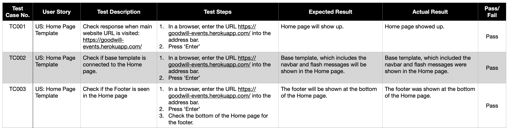

* **FEATURED EVENTS**   
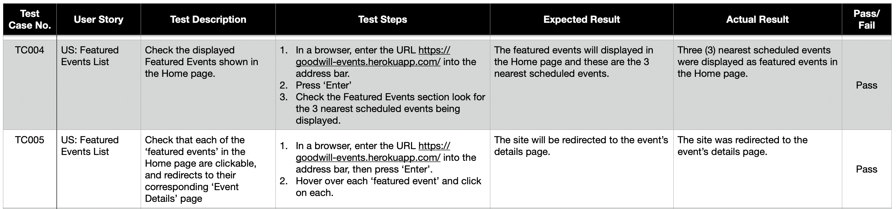

* **ALL EVENTS Page**
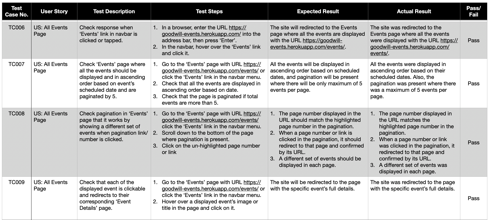

* **SPECIFIC EVENT Page**
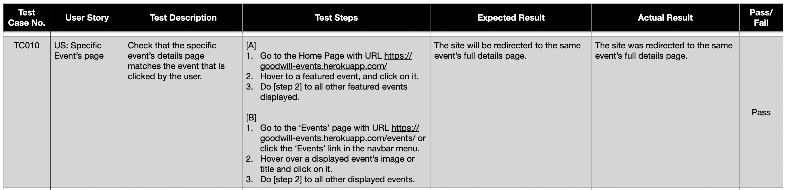

* **USER AUTHENTICATION**   
    Member Registration
    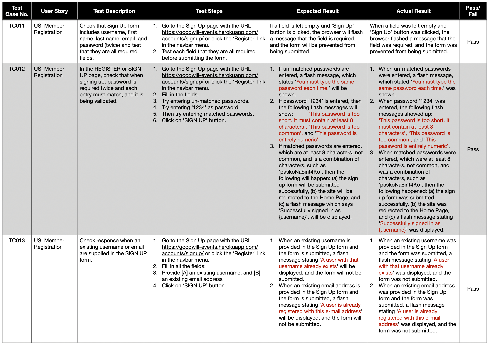     
    Sign In & Sign Out      
    
    Editing Account Information     
    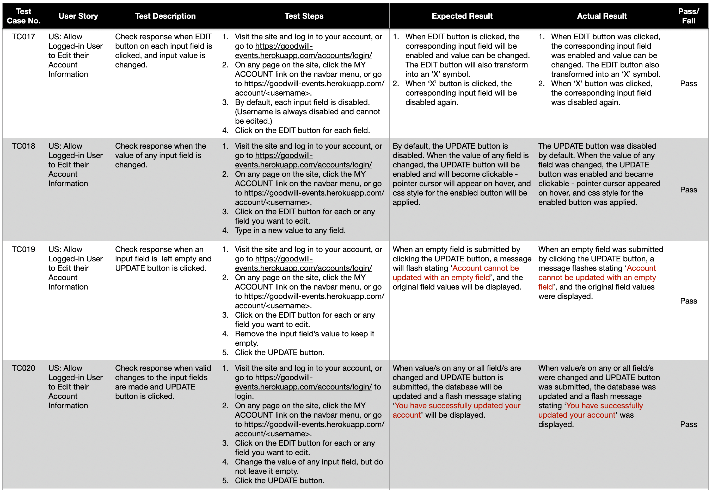
    Change of Password      
    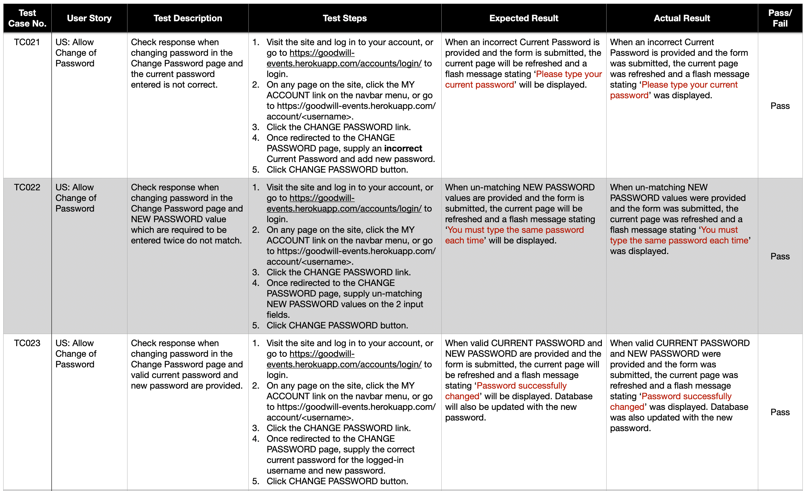
    Password Reset      
    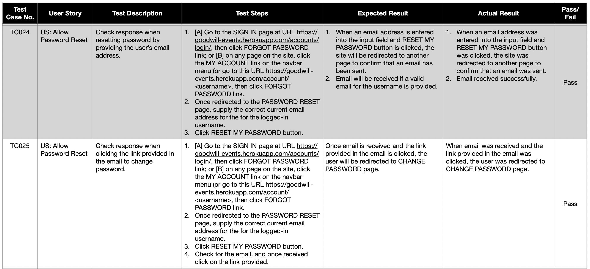

* **LIKES**
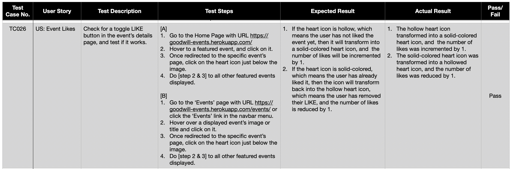

* **COMMENTS**
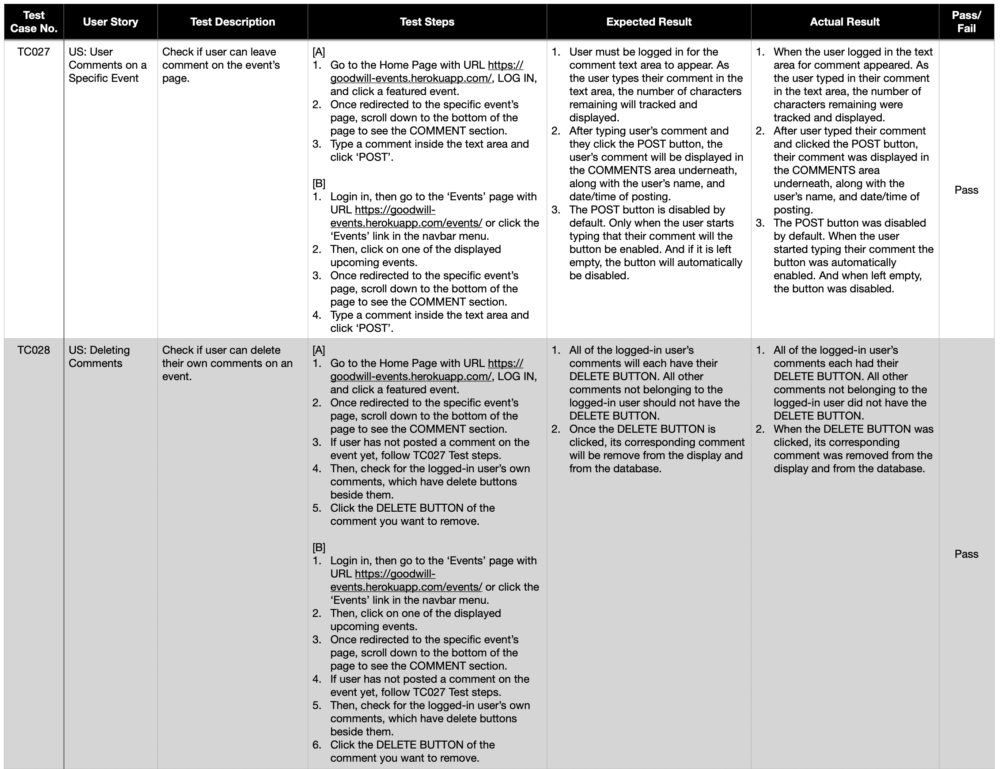

* **EVENT SEATS & RESERVATION**     
    SVG Seat Map's Panning & Zooming Feature
    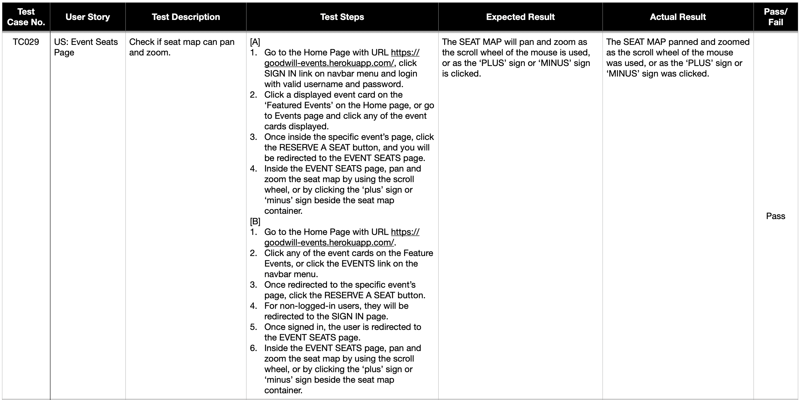    
    Seat Reservation
    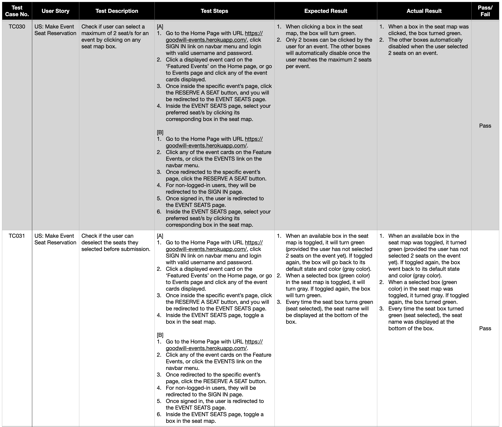     
    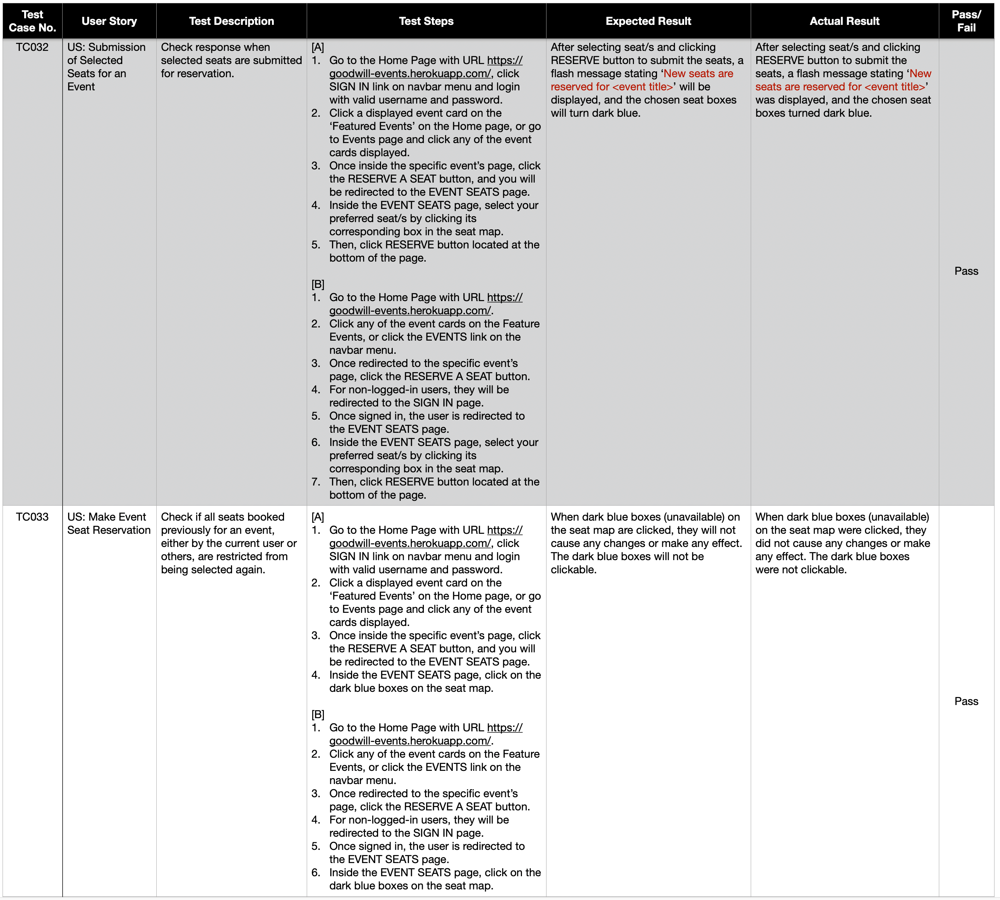  
    Reservation Update & Cancellation
    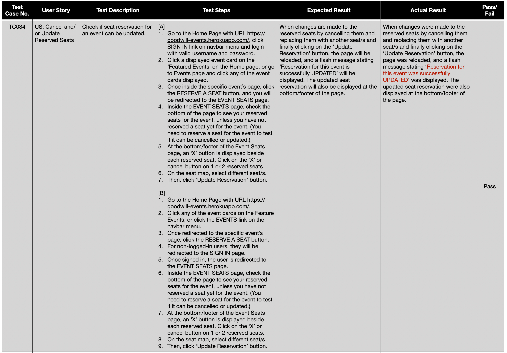
    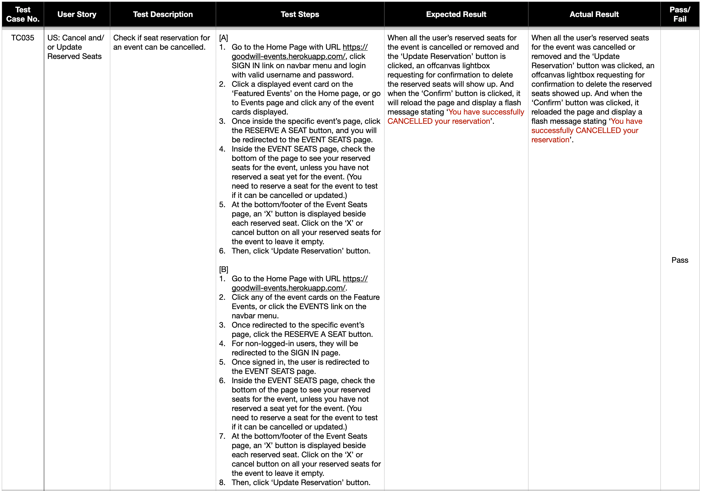  
    Seat Reservation Feature Restricted to Signed-In Users
    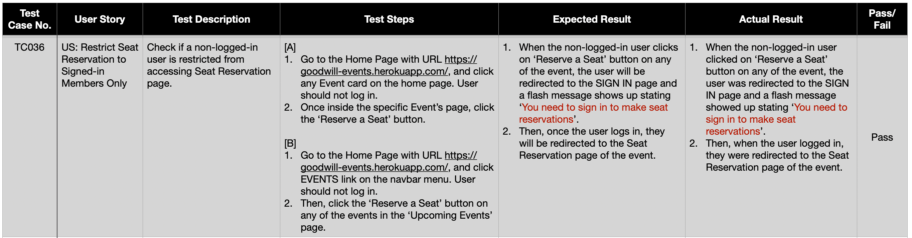  

* **RECYCLING EXPIRED EVENTS**
    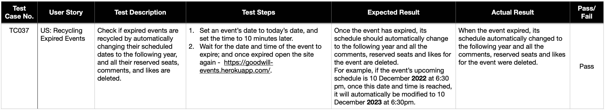

## LIGHTHOUSE TESTING

## RESPONSIVENESS

## VALIDATORS

* **JSHint**
* **PEP8 Online Checker**
* **W3C MarkUp Validator**
* **W3C CSS Validator**

## ACCESSIBILITY