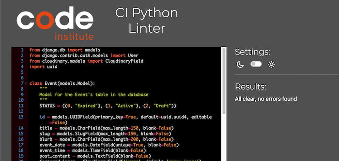
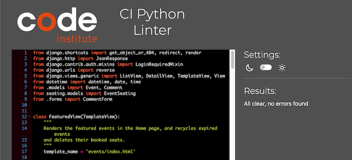
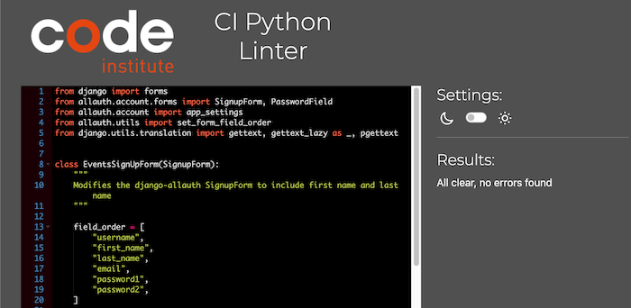
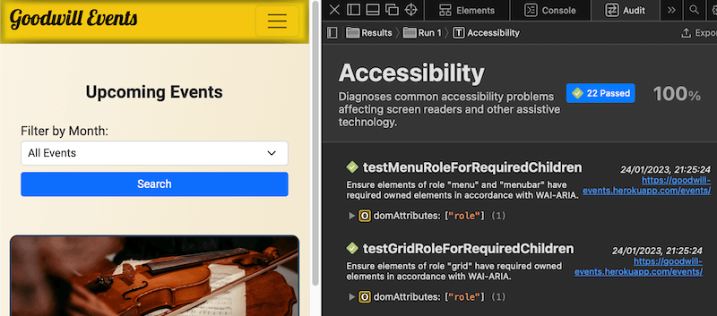
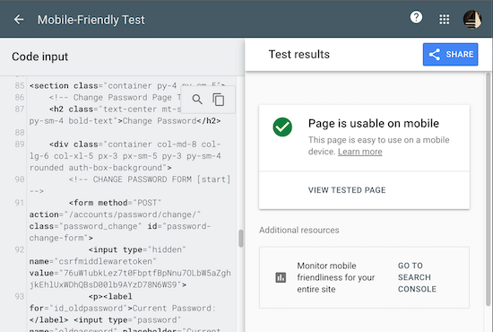
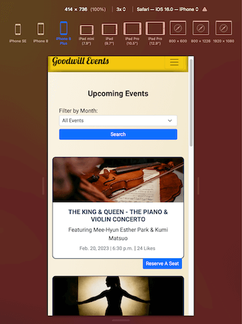

# TESTING

## TABLE OF CONTENTS    
* [**Manual Testing for User Stories**](#manual-testing-user-story-testing)
* [**Manual Testing for Javascript**](#manual-testing-for-javascript)
* [**Python Automated Testing**](#automated-testing-unittest)
* [**Validators**](#validators)     
    * [Python Linter](#ci-python-linter)
    * [JSHINT](#jshint)
    * [Markup Validator](#w3c-markup-validator)
    * [CSS Validator](#w3c-css-validator)
* [**Accessibility**](#accessibility)   
    * [Safari Accessibility Audit Results](#safari-accessibility-audit-results) 
    * [Color Contrast Accessibility Validator Results](#color-contrast-accessibility-validator-results) 
    * [WAVE - Web Accessibility Evaluation Tool](#wave---web-accessibility-evaluation-tool) 
* [**Lighthouse Testing**](#lighthouse-testing)
* [**Responsiveness**](#responsiveness)
    * [Mobile-Friendly Test](#mobile-friendly-test)
    * [Manual Testing for Responsiveness](#manual-testing-for-responsiveness)

### [>> **BACK TO README.MD**](https://github.com/marked-gil/goodwill-events#readme)

## MANUAL TESTING (User Story Testing)
These are the test cases for manual testing on the project's User Stories.

* **HOME Page**     

* **FEATURED EVENTS**   

* **ALL EVENTS Page**

* **SPECIFIC EVENT Page**

* **USER AUTHENTICATION**   
    Member Registration
         
    Sign In & Sign Out      
    
    Editing Account Information     
    
    Change of Password      
    
    Password Reset      
    

* **LIKES**

* **COMMENTS**

* **EVENT SEATS & RESERVATION**     
    SVG Seat Map's Panning & Zooming Feature
        
    Seat Reservation
         
      
    Reservation Update & Cancellation
    
      
    Seat Reservation Feature Restricted to Signed-In Users
      

* **RECYCLING EXPIRED EVENTS**
        

* **FILTERING EVENTS BY MONTH**
    

[<ins>Back to Table of Contents</ins>](#table-of-contents)

## MANUAL TESTING FOR JAVASCRIPT
The results of the manual tests on Javascript are shown below.

### Nav Bar Links
| Test Description | Achieved |
| ---------------- | -------- |
| Nav link is highlighted and disabled when its corresponding page is opened | Yes |

### Events Page (Upcoming Events)
| Test Description | Achieved |
| ---------------- | -------- |
| Current page's number in the pagination nav is highlighted and disabled | Yes |

### Event Details Page (Specific Event's Page)
| Test Description | Achieved |
| ---------------- | -------- |
| Character counter for the comment section tracks the number of characters left with a maximum of 250 characters | Yes |
| 'Post' button of the comment section is disabled when textarea is empty | Yes |
| Page reloads and stays on the comment section after user posted a comment | Yes |
| Page reloads and stays on the comment section after user deleted a comment | Yes |

### Member Account Page
| Test Description | Achieved |
| ---------------- | -------- |
| All input fields in the form are 'read-only' as their initial state | Yes |
| Edit button on each input field removes the 'read-only' status and allow editing of the field | Yes |
| Edit button is switched to 'X' button and vice versa when toggled | Yes |
| 'Update' button is enabled when input field value is changed, and disabled when no changes were made | Yes |

### Seat Reservation Page
| Test Description | Achieved |
| ---------------- | -------- |
| All available seats are clickable as evidence by its color change | Yes |
| All reserved seats are blocked/disabled | Yes |
| When event is fully booked, a message "This event is FULLY BOOKED" is displayed | Yes |
| User's selected seats are displayed at the footer of the page | Yes |
| The 'Reserve' and 'Update reservation' buttons are disabled by default and will only turn active when the user has selected a new seat from the seat map | Yes | 
| User's reserved seats for an event can be cancelled by clicking the 'X' button of the seat number, then the 'Update Reservation' button | Yes |
| When reserving or updating a seat/s by clicking the 'Reserve' button or 'Update Reservation' button, a loading animation shows up and all interactive elements are disabled until the saving process is complete | Yes |
| When all reserved seats are removed and the 'Update Reservation' button is clicked, an offcanvas lightbox shows up with the 'Confirm' button to delete the reservation for the event | Yes |
| Only a maximum of 2 seats can be booked per user per event | Yes |
| A feedback message stating "You've reached the 2 seats maximum per user" is displayed when the user attempts to select more thatn 2 seats per event | Yes |
| The seat map can be panned and zoomed | Yes |
| The seat map is initially blocked with pan and zoom functionality disabled when a user with reserved seats to the event visits the page | Yes |
| The initial seat map blocker can be removed by clicking the 'Edit Reservation' button | Yes |

[<ins>Back to Table of Contents</ins>](#table-of-contents)

## PYTHON AUTOMATED TESTING (Unittest)
There are 18 automated tests created on this project and all of which ran successfully as shown in the image below. The tests checked the following:    
* the correct rendering of the templates/pages,
* the successful 'liking' and posting of comments,
* the creation of new events,
* the signing up, logging in and logging out of users,
* the site's response to very common passwords and invalid emails during signup, and 
* the site's response to incorrect login passwords  

These tests can be seen in the `tests.py` file in each of the apps.

* **How to Run the Tests**
    * Use the **sqlite3 database**. This can be done by either:     
        * Temporarily commenting out the production database URL, and leaving the following code as the default:
            > DATABASES = {
                'default': {
                    'ENGINE': 'django.db.backends.sqlite3',
                    'NAME': os.path.join(BASE_DIR, 'db.sqlite3'),
                }
            }
        * Or, temporarily comment out the DATABASE_URL in the `env` file.
    * Then, use the command "`python3 manage.py test`" to run the tests.

[<ins>Back to Table of Contents</ins>](#table-of-contents)

## VALIDATORS

### **CI Python Linter**
All Python codes on this project were tested using the [CI Python Linter](https://pep8ci.herokuapp.com/), and all results were **"ALL CLEAR, NO ERRORS FOUND"**. See below for the result screenshots for each Python file.   

* [**goodwill_events/SETTINGS.PY**](https://github.com/marked-gil/goodwill-events/blob/main/goodwill_events/settings.py)    
   
* [**goodwill_events/URLS.PY**](https://github.com/marked-gil/goodwill-events/blob/main/goodwill_events/urls.py)    
  
* [**events/ADMIN.PY**](https://github.com/marked-gil/goodwill-events/blob/main/events/admin.py)    
         
* [**events/FORMS.PY**](https://github.com/marked-gil/goodwill-events/blob/main/events/forms.py)    
   
* [**events/TESTS.PY**](https://github.com/marked-gil/goodwill-events/blob/main/events/tests.py)    
   
* [**events/MODELS.PY**](https://github.com/marked-gil/goodwill-events/blob/main/events/models.py)  
 
* [**events/URLS.PY**](https://github.com/marked-gil/goodwill-events/blob/main/events/urls.py)  
 
* [**events/VIEWS.PY**](https://github.com/marked-gil/goodwill-events/blob/main/events/views.py)    

* [**member/FORMS.PY**](https://github.com/marked-gil/goodwill-events/blob/main/member/forms.py)    
   
* [**member/TESTS.PY**](https://github.com/marked-gil/goodwill-events/blob/main/member/tests.py)    

* [**member/URLS.PY**](https://github.com/marked-gil/goodwill-events/blob/main/member/urls.py)  
     
* [**member/VIEWS.PY**](https://github.com/marked-gil/goodwill-events/blob/main/member/views.py)    
   
* [**seating/ADMIN.PY**](https://github.com/marked-gil/goodwill-events/blob/main/seating/admin.py)  
 
* [**seating/FORMS.PY**](https://github.com/marked-gil/goodwill-events/blob/main/seating/forms.py)  
 
* [**seating/MODELS.PY**](https://github.com/marked-gil/goodwill-events/blob/main/seating/models.py)    
   
* [**seating/TESTS.PY**](https://github.com/marked-gil/goodwill-events/blob/main/seating/tests.py)  
     
* [**seating/URLS.PY**](https://github.com/marked-gil/goodwill-events/blob/main/seating/urls.py)    
   
* [**seating/VIEWS.PY**](https://github.com/marked-gil/goodwill-events/blob/main/seating/views.py)  
  

[<ins>Back to Table of Contents</ins>](#table-of-contents)

### **JSHint**  
The Javascript codes on this project were tested and validated by [JSHINT](https://jshint.com/), which is a tool analysis JS code for errors and potential problems. All the results from the JSHINT showed **NO ERROR** for this project.  
See individual result screenshot below. 

* [**script.js**](https://github.com/marked-gil/goodwill-events/blob/main/static/js/script.js)  
    
* [**seating_script.js**](https://github.com/marked-gil/goodwill-events/blob/main/static/js/seating_script.js)  
    
* [**seatmap_panzoom.js**](https://github.com/marked-gil/goodwill-events/blob/main/static/js/seatmap_panzoom.js)    
  

[<ins>Back to Table of Contents</ins>](#table-of-contents)

### **W3C MarkUp Validator**    
The HTML files on this project were tested and validated by [W3C Markup Validation Service](https://validator.w3.org/). **NO ERRORS OR WARNINGS** were shown on the results.

* **Home Page**  -- [Click for Result](https://github.com/marked-gil/goodwill-events/blob/main/docs/testing_screenshots/html_validator/home-html-validated.png)
* **Events (Upcoming Events) Page** -- [Click for Result](https://github.com/marked-gil/goodwill-events/blob/main/docs/testing_screenshots/html_validator/events-page-html-validated.png)
* **Seat Map (Generic) Page** -- [Click for Result](https://github.com/marked-gil/goodwill-events/blob/main/docs/testing_screenshots/html_validator/generic-seatmap-html-validated.png)   
* **Specific Event Page** -- [Click for Result](https://github.com/marked-gil/goodwill-events/blob/main/docs/testing_screenshots/html_validator/specific-event-page-html-validated.png)  
* **Seat Reservation Page** -- [Click for Result](https://github.com/marked-gil/goodwill-events/blob/main/docs/testing_screenshots/html_validator/seat-reservation-html-validated.png)    
* **Member Account Page** -- [Click for Result](https://github.com/marked-gil/goodwill-events/blob/main/docs/testing_screenshots/html_validator/member-account-html-validated.png)
* **Sign In Page** -- [Click for Result](https://github.com/marked-gil/goodwill-events/blob/main/docs/testing_screenshots/html_validator/signin-html-validated.png)
* **Sign Up Page** -- [Click for Result](https://github.com/marked-gil/goodwill-events/blob/main/docs/testing_screenshots/html_validator/signup-validated.png) 
* **Sign Out Page** -- [Click for Result](https://github.com/marked-gil/goodwill-events/blob/main/docs/testing_screenshots/html_validator/signout-html-validated.png)    
* **Password Reset Page** -- [Click for Result](https://github.com/marked-gil/goodwill-events/blob/main/docs/testing_screenshots/html_validator/password-reset-validated.png)  
* **Password Reset - Emailed Link** -- [Click for Result](https://github.com/marked-gil/goodwill-events/blob/main/docs/testing_screenshots/html_validator/password-reset-emailed-html-validated.png)
* **Change Password Page** -- [Click for Result](https://github.com/marked-gil/goodwill-events/blob/main/docs/testing_screenshots/html_validator/change-password-html-validated.png)     
* **Change Password via Link** -- [Click for Result](https://github.com/marked-gil/goodwill-events/blob/main/docs/testing_screenshots/html_validator/change-password-via-link-html-validated.png) 
* **Change Password Done** -- [Click for Result](https://github.com/marked-gil/goodwill-events/blob/main/docs/testing_screenshots/html_validator/change-password-done-html-validated.png) 

### **W3C CSS Validator**  
The CSS codes on this project were validated by the [W3C CSS Validation Service](https://jigsaw.w3.org/css-validator/). All results showed **"NO ERROR FOUND"**. See below for each result.
* [**style.css**](https://github.com/marked-gil/goodwill-events/blob/main/static/css/style.css)

* [**seating_style.css**](https://github.com/marked-gil/goodwill-events/blob/main/static/css/seating_style.css)

[<ins>Back to Table of Contents</ins>](#table-of-contents)

## ACCESSIBILITY

### **Safari Accessibility Audit Results**

Safari's Accessibility Audit inspects the site's pages for accessibility issues, and each page on this site is 100% accessible based on the results shown below.

* **Home Page**     
  
* **Events (Upcoming Events) Page**     
    
* **Seat Map (Generic) Page**    
  
* **Specific Event Page**   
    
* **Seat Reservation Page**    
  
* **Member Account Page**   
    
* **Sign In Page**  

* **Sign Up Page**  

* **Sign Out Page**     
  
* **Password Reset Page**   
    
* **Change Password Page**      
   

[Back to Table of Contents](#table-of-contents)

### **Color Contrast Accessibility Validator Results**      
Using the [a11Y's Color Contrast Accessibility Validator](https://color.a11y.com/), this site is validated to be compliant with website accessibilities regulations on colour contrast.
However, the pages that require logging in cannot be analysed by the validator, but their color contrast was validated by other tools such as the 'Safari Audit', 'WAVE', and 'Lighthouse'.

* **Home Page**     
 
* **Events (Upcoming Events) Page**     
      
* **Seat Map (Generic) Page**   
  
* **Specific Event Page**   
      
* **Sign In Page**  
    
* **Sign Up Page**  
    
* **Password Reset Page**   
 

[<ins>Back to Table of Contents</ins>](#table-of-contents)

### **WAVE - Web Accessibility Evaluation Tool**
This project utilised the [WAVE - Web Accessibility Evaluation Tool](https://wave.webaim.org/) browser extension to ensure its accessibility.       

### **LIGHTHOUSE TESTING**
* **Home Page**     
     
* **Events (Upcoming Events) Page**     
     
* **Seat Map (Generic) Page**    
  
* **Specific Event Page**   
  
* **Seat Reservation Page**    
      
* **Member Account Page**   
     
* **Sign In Page**  
         
* **Sign Up Page**  
         
* **Sign Out Page**     
  
* **Password Reset Page**   
     
* **Change Password Page**      
   

[<ins>Back to Table of Contents</ins>](#table-of-contents)

## RESPONSIVENESS

This website is designed to be fully responsive from a minimum screen size of 280px.

### **Mobile-Friendly Test**
The tool [Mobile-Friendly Test](https://search.google.com/test/mobile-friendly) validated the ease and friendliness of the site when used on small screens such as mobile devices.  
**Note:** The Mobile-Friendly Test tool could not detect the ability of the seat map to pan and zoom; thus, manual testing was used for the Seat Reservation page.

* **Home Page**     
    
* **Events (Upcoming Events) Page**   
    
* **Seat Map (Generic) Page**    
     
* **Specific Event Page**   
    
* **Member Account Page**   
    
* **Sign In Page**  
   
* **Sign Up Page**  
   
* **Sign Out Page**     
     
* **Password Reset Page**   
    
* **Change Password Page**      
      

[<ins>Back to Table of Contents</ins>](#table-of-contents)

### **Manual Testing for Responsiveness**

The web developer tools of the 4 main websites (Chrome, Firefox, Edge, and Safari) were used to manually test each page of this site for their responsiveness. Below are sample screenshots:

* **Chrome**    
    
* **Firefox**   
    
* **Microsoft Edge**    
  
* **Safari**    
     

[<ins>Back to Table of Contents</ins>](#table-of-contents)

### [>> **BACK TO README.MD**](https://github.com/marked-gil/goodwill-events#readme)