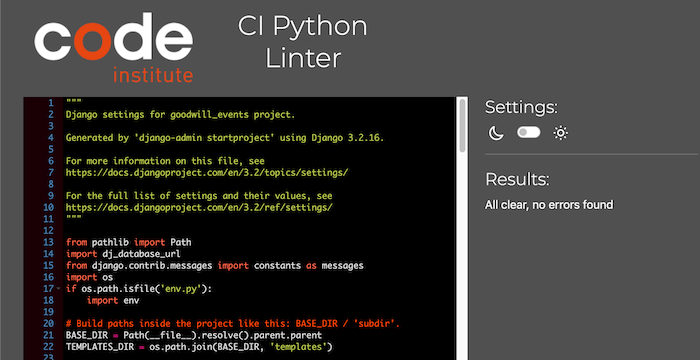
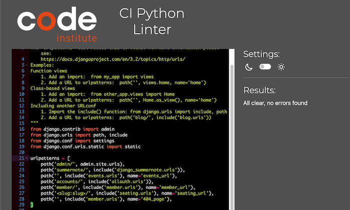
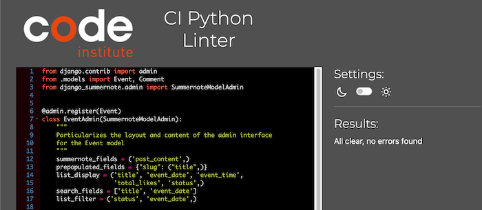
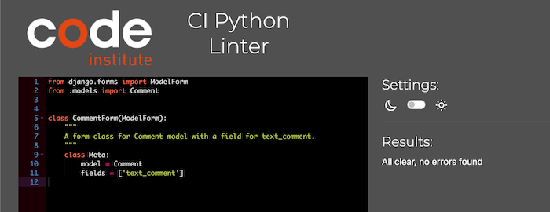
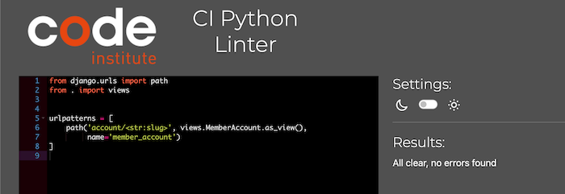
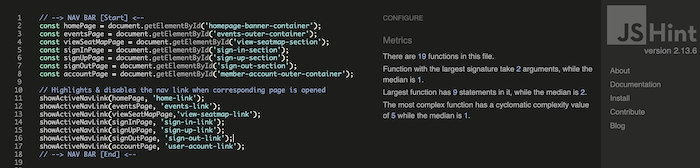

# TESTING

## TEST CASES (User Story Testing)

* **HOME Page**     

* **FEATURED EVENTS**   

* **ALL EVENTS Page**

* **SPECIFIC EVENT Page**

* **USER AUTHENTICATION**   
    Member Registration
         
    Sign In & Sign Out      
    
    Editing Account Information     
    
    Change of Password      
    
    Password Reset      
    

* **LIKES**

* **COMMENTS**

* **EVENT SEATS & RESERVATION**     
    SVG Seat Map's Panning & Zooming Feature
        
    Seat Reservation
         
      
    Reservation Update & Cancellation
    
      
    Seat Reservation Feature Restricted to Signed-In Users
      

* **RECYCLING EXPIRED EVENTS**
    

## LIGHTHOUSE TESTING

## RESPONSIVENESS

## VALIDATORS

### CI Python Linter
* [**goodwill_events/SETTINGS.PY**](https://github.com/marked-gil/goodwill-events/blob/main/goodwill_events/settings.py)    
   
* [**goodwill_events/URLS.PY**](https://github.com/marked-gil/goodwill-events/blob/main/goodwill_events/urls.py)    
  
* [**events/ADMIN.PY**](https://github.com/marked-gil/goodwill-events/blob/main/events/admin.py)    
         
* [**events/FORMS.PY**](https://github.com/marked-gil/goodwill-events/blob/main/events/forms.py)    
   
* [**events/MODELS.PY**](https://github.com/marked-gil/goodwill-events/blob/main/events/models.py)  
 
* [**events/URLS.PY**](https://github.com/marked-gil/goodwill-events/blob/main/events/urls.py)  
 
* [**events/VIEWS.PY**](https://github.com/marked-gil/goodwill-events/blob/main/events/views.py)    

* [**member/FORMS.PY**](https://github.com/marked-gil/goodwill-events/blob/main/member/forms.py)    
   
* [**member/URLS.PY**](https://github.com/marked-gil/goodwill-events/blob/main/member/urls.py)  
     
* [**member/VIEWS.PY**](https://github.com/marked-gil/goodwill-events/blob/main/member/views.py)    
   
* [**seating/ADMIN.PY**](https://github.com/marked-gil/goodwill-events/blob/main/seating/admin.py)
 
* [**seating/FORMS.PY**](https://github.com/marked-gil/goodwill-events/blob/main/seating/forms.py)  
 
* [**seating/MODELS.PY**](https://github.com/marked-gil/goodwill-events/blob/main/seating/models.py)    
   
* [**seating/URLS.PY**](https://github.com/marked-gil/goodwill-events/blob/main/seating/urls.py)    
   
* [**seating/VIEWS.PY**](https://github.com/marked-gil/goodwill-events/blob/main/seating/views.py)  
  
### JSHint
* [**script.js**](https://github.com/marked-gil/goodwill-events/blob/main/static/js/script.js)  
    
* [**seating_script.js**](https://github.com/marked-gil/goodwill-events/blob/main/static/js/seating_script.js)  
    
* [**seatmap_panzoom.js**](https://github.com/marked-gil/goodwill-events/blob/main/static/js/seatmap_panzoom.js)    
  

### W3C MarkUp Validator
### W3C CSS Validator

## ACCESSIBILITY