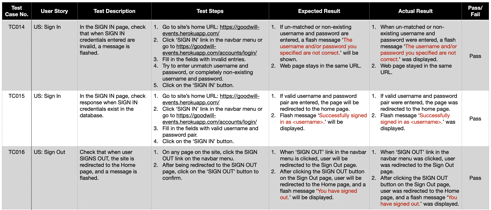
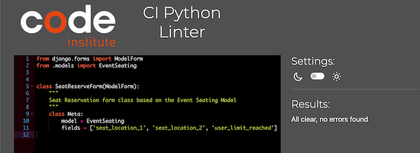
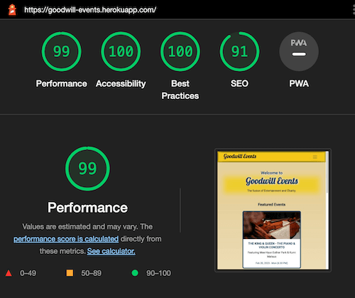

# TESTING

## TABLE OF CONTENTS    
* [**Test Cases**](#test-cases-user-story-testing)
* [**Validators**](#validators)     
    * [Python Linter](#ci-python-linter)
    * [JSHINT](#jshint)
    * [Markup Validator](#w3c-markup-validator)
    * [CSS Validator](#w3c-css-validator)
* [**Accessibility**](#accessibility)   
    * [Safari Accessibility Audit Results](#safari-accessibility-audit-results) 
    * [Color Contrast Accessibility Validator Results](#color-contrast-accessibility-validator-results) 
    * [WAVE - Web Accessibility Evaluation Tool](#wave---web-accessibility-evaluation-tool) 
* [**Lighthouse Testing**](#lighthouse-testing)
* [**Responsiveness**](#responsiveness)

## TEST CASES (User Story Testing)

* **HOME Page**     

* **FEATURED EVENTS**   

* **ALL EVENTS Page**

* **SPECIFIC EVENT Page**

* **USER AUTHENTICATION**   
    Member Registration
         
    Sign In & Sign Out      
    
    Editing Account Information     
    
    Change of Password      
    
    Password Reset      
    

* **LIKES**

* **COMMENTS**

* **EVENT SEATS & RESERVATION**     
    SVG Seat Map's Panning & Zooming Feature
        
    Seat Reservation
         
      
    Reservation Update & Cancellation
    
      
    Seat Reservation Feature Restricted to Signed-In Users
      

* **RECYCLING EXPIRED EVENTS**
    

## VALIDATORS

### **CI Python Linter**
All Python codes on this project were tested using the [CI Python Linter](https://pep8ci.herokuapp.com/), and all results were **"ALL CLEAR, NO ERRORS FOUND"**. See below for the result screenshots for each Python file.   

* [**goodwill_events/SETTINGS.PY**](https://github.com/marked-gil/goodwill-events/blob/main/goodwill_events/settings.py)    
   
* [**goodwill_events/URLS.PY**](https://github.com/marked-gil/goodwill-events/blob/main/goodwill_events/urls.py)    
  
* [**events/ADMIN.PY**](https://github.com/marked-gil/goodwill-events/blob/main/events/admin.py)    
         
* [**events/FORMS.PY**](https://github.com/marked-gil/goodwill-events/blob/main/events/forms.py)    
   
* [**events/MODELS.PY**](https://github.com/marked-gil/goodwill-events/blob/main/events/models.py)  
 
* [**events/URLS.PY**](https://github.com/marked-gil/goodwill-events/blob/main/events/urls.py)  
 
* [**events/VIEWS.PY**](https://github.com/marked-gil/goodwill-events/blob/main/events/views.py)    

* [**member/FORMS.PY**](https://github.com/marked-gil/goodwill-events/blob/main/member/forms.py)    
   
* [**member/URLS.PY**](https://github.com/marked-gil/goodwill-events/blob/main/member/urls.py)  
     
* [**member/VIEWS.PY**](https://github.com/marked-gil/goodwill-events/blob/main/member/views.py)    
   
* [**seating/ADMIN.PY**](https://github.com/marked-gil/goodwill-events/blob/main/seating/admin.py)
 
* [**seating/FORMS.PY**](https://github.com/marked-gil/goodwill-events/blob/main/seating/forms.py)  
 
* [**seating/MODELS.PY**](https://github.com/marked-gil/goodwill-events/blob/main/seating/models.py)    
   
* [**seating/URLS.PY**](https://github.com/marked-gil/goodwill-events/blob/main/seating/urls.py)    
   
* [**seating/VIEWS.PY**](https://github.com/marked-gil/goodwill-events/blob/main/seating/views.py)  
  

### **JSHint**  
The Javascript codes on this project were tested and validated by [JSHINT](https://jshint.com/), which is a tool analysis JS code for errors and potential problems. All the results from the JSHINT showed **NO ERROR** for this project.  
See individual result screenshot below. 

* [**script.js**](https://github.com/marked-gil/goodwill-events/blob/main/static/js/script.js)  
    
* [**seating_script.js**](https://github.com/marked-gil/goodwill-events/blob/main/static/js/seating_script.js)  
    
* [**seatmap_panzoom.js**](https://github.com/marked-gil/goodwill-events/blob/main/static/js/seatmap_panzoom.js)    
  

### **W3C MarkUp Validator**    
The HTML files on this project were tested and validated by [W3C Markup Validation Service](https://validator.w3.org/). **NO ERRORS OR WARNINGS** were shown on the results.    

* **Home Page**  -- [Click for Result](https://github.com/marked-gil/goodwill-events/blob/main/docs/testing_screenshots/html_validator/home-html-validated.png)
* **Events (Upcoming Events) Page** -- [Click for Result](https://github.com/marked-gil/goodwill-events/blob/main/docs/testing_screenshots/html_validator/events-page-html-validated.png)
* **Seat Map (Generic) Page** -- [Click for Result](https://github.com/marked-gil/goodwill-events/blob/main/docs/testing_screenshots/html_validator/generic-seatmap-html-validated.png)   
* **Specific Event Page** -- [Click for Result](https://github.com/marked-gil/goodwill-events/blob/main/docs/testing_screenshots/html_validator/specific-event-page-html-validated.png)  
* **Seat Reservation Page** -- [Click for Result](https://github.com/marked-gil/goodwill-events/blob/main/docs/testing_screenshots/html_validator/seat-reservation-html-validated.png)    
* **Member Account Page** -- [Click for Result]()
* **Sign In Page** -- [Click for Result](https://github.com/marked-gil/goodwill-events/blob/main/docs/testing_screenshots/html_validator/signin-html-validated.png)
* **Sign Up Page** -- [Click for Result](https://github.com/marked-gil/goodwill-events/blob/main/docs/testing_screenshots/html_validator/signup-validated.png) 
* **Sign Out Page** -- [Click for Result](https://github.com/marked-gil/goodwill-events/blob/main/docs/testing_screenshots/html_validator/signout-html-validated.png)    
* **Password Reset Page** -- [Click for Result](https://github.com/marked-gil/goodwill-events/blob/main/docs/testing_screenshots/html_validator/password-reset-validated.png)  
* **Password Reset - Emailed Link** -- [Click for Result](https://github.com/marked-gil/goodwill-events/blob/main/docs/testing_screenshots/html_validator/password-reset-emailed-html-validated.png)
* **Change Password Page** -- [Click for Result](https://github.com/marked-gil/goodwill-events/blob/main/docs/testing_screenshots/html_validator/change-password-html-validated.png)     
* **Change Password via Link** -- [Click for Result](https://github.com/marked-gil/goodwill-events/blob/main/docs/testing_screenshots/html_validator/change-password-via-link-html-validated.png) 
* **Change Password Done** -- [Click for Result](https://github.com/marked-gil/goodwill-events/blob/main/docs/testing_screenshots/html_validator/change-password-done-html-validated.png) 

### **W3C CSS Validator **  
The CSS codes on this project were validated by the [W3C CSS Validation Service](https://jigsaw.w3.org/css-validator/). All results showed **"NO ERROR FOUND"**. See below for each result.
* [**style.css**](https://github.com/marked-gil/goodwill-events/blob/main/static/css/style.css)

* [**seating_style.css**](https://github.com/marked-gil/goodwill-events/blob/main/static/css/seating_style.css)

## ACCESSIBILITY

### **Safari Accessibility Audit Results**
### **Color Contrast Accessibility Validator Results**
### **WAVE - Web Accessibility Evaluation Tool**

## LIGHTHOUSE TESTING
* **Home Page**     
     
* **Events (Upcoming Events) Page**     
     
* **Seat Map (Generic) Page**    
  
* **Specific Event Page**   
  
* **Seat Reservation Page**    
      
* **Member Account Page**   
     
* **Sign In Page**  
         
* **Sign Up Page**  
         
* **Sign Out Page**     
  
* **Password Reset Page**   
     
* **Change Password Page**      
   

## RESPONSIVENESS